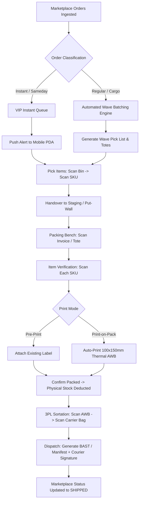

# SuperDates - Standard Operating Procedure (SOP) & Warehouse Workflow
## Comprehensive Physical & Digital Operational Manual v2.0

---

## 1. End-to-End Fulfillment Flowchart

---

## 2. Detailed Step-by-Step Operations

### Step 1: Omnichannel Order Management & Filtering (Admin / OMS)
1. **Automated Order Sync**: Orders from Tokopedia, Shopee, TikTok Shop, Lazada, and Bukalapak enter the WMS within $<30$ seconds.
2. **Multi-Dimensional Filtering**: Admin accesses the Order Control Center with dynamic multi-tier filters:
   - **Logistic Tier**: Instant (2h SLA), Sameday, Next Day Regular, Economy, Cargo, COD.
   - **Courier Partner**: Shopee Express (SPX), J&T Express, SiCepat, JNE, NinjaVan, Anteraja, GoSend, GrabExpress.
   - **Order Complexity**: Single-Item Single-SKU (Hot Items), Multi-Item Single-SKU (Bulk), Multi-Item Mixed SKU.
   - **Stock Status**: All Allocated, Partial Out of Stock (Exceptions), Pre-Order.

---

### Step 2: Wave & Batch Generation (Supervisor / Auto-Engine)
1. **Wave Rules**: The system batches orders into optimal waves (e.g., 20–50 orders per wave) based on zone layout and courier cut-off times.
2. **Instant/Sameday Fast-Track**: Instant orders automatically bypass wave grouping and route directly as priority 1-to-1 pick tasks.
3. **Pick Task Assignment**: Wave tasks are dispatched to the next available Picker's PDA with an optimized S-shape aisle routing sequence.

---

### Step 3: Picking Execution & In-Flight Validation (Picker)
1. **PDA Notification**: Picker receives an audio chime and visual task list on the mobile PDA.
2. **Pick Confirmation Loop**:
   - Operator walks to suggested bin location $\rightarrow$ **Scans Bin Barcode** (System verifies correct location).
   - Operator picks product $\rightarrow$ **Scans Item Barcode** (System validates Master SKU & Expiry Date).
   - Operator enters picked quantity $\rightarrow$ Places items into assigned Wave Tote.
3. **In-Flight Cancellation Handling**:
   - If a buyer cancels the order while in progress, the PDA emits a warning alarm: *"Order Cancelled by Customer - Do Not Pick. Return SKU to Bin [Bin_ID]"*.
4. **Staging Handover**:
   - Picker transports the completed tote to the Packing Staging Area $\rightarrow$ **Scans Staging Rack Barcode** (e.g., `STAGE-A-04`).
   - System automatically marks the wave as `READY_FOR_PACKING` and notifies packing stations.

---

### Step 4: Packing, SKU Verification & Labeling (Packer)
1. **Session Start**: Packer selects a tote or scans the Order Invoice / Picking Slip.
2. **Item-by-Item Scan Verification**:
   - System displays required SKUs, quantities, and product thumbnail images.
   - Packer scans each physical item barcode one by one.
   - *Error Prevention*: Scanning an unlisted item triggers a red screen lockout and error sound.
3. **Dual Label Printing Protocol**:
   - **Option A (Print-on-Pack - Recommended)**: Once all items are validated, the thermal printer at the packing desk automatically prints the exact 100x150mm courier shipping label (AWB).
   - **Option B (Pre-printed AWB)**: Packer scans the pre-printed shipping label to match with the order invoice.
4. **Final Packaging & Stock Ledger Mutation**:
   - Packer seals items in polymailer/box and attaches the AWB.
   - Packer taps **"Confirm Packed"** or scans `BARCODE-CONFIRM-PACK`.
   - **System Action**: Physical warehouse stock is immediately deducted from the inventory ledger (`Allocated` $\rightarrow$ `Packed`).

---

### Step 5: Carrier Sortation & Redundant Scanning (Sorter / Dispatcher)
1. **Sortation Setup**: The sorting station is equipped with dedicated bags/cages for each 3PL partner (SPX, J&T, SiCepat, etc.).
2. **Redundant Validation Scan**:
   - Operator scans the **Shipping Label AWB**.
   - System displays the designated carrier chute and illuminates the target bin (or displays big-screen visual confirmation).
   - Operator scans the **Sortation Chute Barcode** to confirm placement.
3. **Mismatch Protection**: If an operator accidentally puts a Shopee Express parcel into a J&T bag, the system triggers a loud buzzer and blocks the scan until corrected.

---

### Step 6: Manifestation & 3PL Courier Handover (BAST)
1. **Manifest Finalization**:
   - When the courier truck arrives, the dispatcher selects the carrier on the WMS and closes the active batch bag.
   - System generates a serialized **Digital Manifest (Surat Jalan / BAST)** containing total package count and all AWB numbers.
2. **Handover & Driver Sign-off**:
   - Courier driver signs directly on the mobile tablet / PDA screen and enters driver ID/vehicle plate number.
3. **Omnichannel Status Push**:
   - System marks all orders in the batch as `SHIPPED / HANDED_OVER`.
   - WMS triggers real-time API callbacks to Tokopedia, Shopee, TikTok Shop, etc., updating the customer-facing status to *"In Transit"*.

---

## 3. Exception & Edge Case SOP

| Edge Case | Detection Point | Standard Operating Procedure |
|---|---|---|
| **Bin Item Empty (Short Pick)** | Picker at Bin | 1. Picker taps "Report Short Pick" on PDA. 2. System records zero-count trigger for inventory team. 3. System re-routes picker to secondary reserve bin or splits wave. 4. Inventory Controller receives instant replenishment task. |
| **Damaged Item at Picking/Packing** | Picker or Packer | 1. Operator scans item and taps "Mark as Damaged". 2. Item is physically moved to `QUARANTINE-BIN`. 3. Replacement SKU is fetched from reserve bin. |
| **Buyer Cancellation Mid-Process** | In-flight WebSocket Event | 1. Screen displays red modal lockout. 2. Order is auto-removed from packing queue. 3. Item is placed in `RESTOCK-STAGING` for return to bin. |
| **Barcode Unreadable / Damaged Label** | Packing / Sorting | 1. Packer searches Master SKU via lookup / manual entry with supervisor PIN. 2. System triggers immediate reprint of SKU barcode. |
| **Carrier Failed Pickup / Delay** | Dispatch Staging | 1. System flags SLA risk if parcels remain in staging past cut-off. 2. Dispatcher can re-assign orders to backup courier via OMS interface. |
