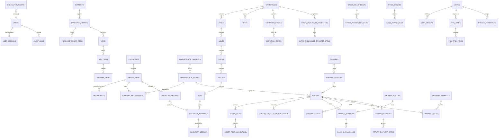

# SuperDates WMS - Enterprise RDBMS Database Design & Data Dictionary
## Comprehensive PostgreSQL Schema Specification (v2.0)

---

## 1. Executive Architectural Overview & ACID Guarantees

SuperDates WMS is designed on **PostgreSQL 16+** as the central transactional database. This schema follows strict **Relational Database Management System (RDBMS)** normalization (3NF/BCNF) and enforces enterprise-grade **ACID (Atomicity, Consistency, Isolation, Durability)** compliance across high-concurrency omnichannel warehouse operations.

### 1.1. Core Invariants & Mathematical Guarantees

#### 1. Five-State Double-Entry Inventory Balance Invariant
Every physical unit in the warehouse must reside in exactly one state across all bin locations. The aggregated balance at any moment must satisfy:
$$\text{Stock on Hand (SOH)} = \text{qty\_available} + \text{qty\_allocated} + \text{qty\_picked} + \text{qty\_packed} + \text{qty\_quarantine}$$
$$\forall \text{ state } \in \{\text{available, allocated, picked, packed, quarantine}\}, \quad \text{qty\_state} \ge 0$$

#### 2. Immutable Transaction Ledger
Inventory balances (`inventory_balances`) are snapshots backed by an append-only double-entry transaction ledger (`inventory_ledger`). Every stock mutation requires a debit from a source state/bin and a credit to a destination state/bin inside an atomic database transaction (`BEGIN ... COMMIT`).

#### 3. Concurrency & Race-Condition Prevention
- **Pessimistic Row-Level Locking (`SELECT ... FOR UPDATE`)**: Used during order allocation, batch wave picking, and packing confirmation to prevent flash-sale overselling.
- **Optimistic Concurrency Control (`version` column)**: Enforced on `inventory_balances` and `orders` to detect stale updates.
- **Zero In-Flight Loss**: In-flight buyer cancellations are intercepted through atomic state machines that freeze picking/packing tasks and route goods to `RESTOCK_STAGING`.

---

## 2. Complete Entity-Relationship Overview



---

## 3. Database Schema Specification (Data Dictionary)

---

### Module 1: Identity, Authentication & RBAC

#### 1.1. `users`
Central user repository for warehouse administrators, supervisors, pickers, packers, and dispatchers.

| Column | Data Type | Nullable | Default | Constraints & Description |
|---|---|---|---|---|
| `id` | `UUID` | No | `gen_random_uuid()` | **PK** |
| `username` | `VARCHAR(50)` | No | - | **UNIQUE**, Alphanumeric username |
| `email` | `VARCHAR(255)` | No | - | **UNIQUE**, Valid email address format |
| `password_hash` | `VARCHAR(255)` | No | - | Argon2id / bcrypt password hash |
| `full_name` | `VARCHAR(100)` | No | - | Operator full name |
| `role` | `VARCHAR(30)` | No | - | `CHECK (role IN ('SUPER_ADMIN', 'WAREHOUSE_MANAGER', 'INVENTORY_CONTROLLER', 'ORDER_ADMIN', 'PICKER', 'PACKER', 'DISPATCHER'))` |
| `supervisor_pin` | `VARCHAR(255)` | Yes | `NULL` | Hashed 6-digit PIN for supervisor overrides on mobile/PDA |
| `phone_number` | `VARCHAR(20)` | Yes | `NULL` | Operator phone number |
| `avatar_url` | `VARCHAR(500)` | Yes | `NULL` | Avatar profile image URL |
| `assigned_warehouse_id` | `UUID` | Yes | `NULL` | **FK** $\rightarrow$ `warehouses(id)` (Default assigned facility) |
| `is_active` | `BOOLEAN` | No | `TRUE` | Account active flag |
| `last_login_at` | `TIMESTAMPTZ` | Yes | `NULL` | Last authentication timestamp |
| `created_at` | `TIMESTAMPTZ` | No | `CURRENT_TIMESTAMP` | Row creation timestamp |
| `updated_at` | `TIMESTAMPTZ` | No | `CURRENT_TIMESTAMP` | Row last update timestamp |

- **Indexes**: `idx_users_role`, `idx_users_warehouse`.

---

#### 1.2. `roles_permissions`
Granular access control matrix governing specific operational capabilities.

| Column | Data Type | Nullable | Default | Constraints & Description |
|---|---|---|---|---|
| `id` | `UUID` | No | `gen_random_uuid()` | **PK** |
| `role` | `VARCHAR(30)` | No | - | Role identifier matching `users.role` |
| `permission_code` | `VARCHAR(100)` | No | - | E.g. `order:approve_cancel`, `inventory:adjust`, `wave:create` |
| `description` | `VARCHAR(255)` | No | - | Human-readable explanation of capability |
| `created_at` | `TIMESTAMPTZ` | No | `CURRENT_TIMESTAMP` | Timestamp |

- **Unique Constraint**: `UNIQUE(role, permission_code)`.

---

#### 1.3. `user_sessions`
Active JWT session registry with IP tracking, device telemetry, and fast revocation.

| Column | Data Type | Nullable | Default | Constraints & Description |
|---|---|---|---|---|
| `id` | `UUID` | No | `gen_random_uuid()` | **PK** |
| `user_id` | `UUID` | No | - | **FK** $\rightarrow$ `users(id)` `ON DELETE CASCADE` |
| `session_token` | `VARCHAR(255)` | No | - | **UNIQUE**, SHA-256 token hash |
| `device_type` | `VARCHAR(20)` | No | `'DESKTOP'` | `CHECK (device_type IN ('DESKTOP', 'PDA_HANDHELD', 'TABLET'))` |
| `ip_address` | `INET` | No | - | Client IP address |
| `user_agent` | `TEXT` | Yes | `NULL` | Browser / PDA Client user agent |
| `is_revoked` | `BOOLEAN` | No | `FALSE` | Revocation status |
| `expires_at` | `TIMESTAMPTZ` | No | - | Session expiration timestamp |
| `created_at` | `TIMESTAMPTZ` | No | `CURRENT_TIMESTAMP` | Creation timestamp |

- **Indexes**: `idx_user_sessions_user_active` (`user_id`, `is_revoked`, `expires_at`).

---

#### 1.4. `audit_logs`
Immutable audit journal recording every administrative action, data override, and critical event.

| Column | Data Type | Nullable | Default | Constraints & Description |
|---|---|---|---|---|
| `id` | `UUID` | No | `gen_random_uuid()` | **PK** |
| `user_id` | `UUID` | Yes | `NULL` | **FK** $\rightarrow$ `users(id)` `ON DELETE SET NULL` |
| `action` | `VARCHAR(50)` | No | - | E.g. `MANUAL_ALLOCATION`, `PIN_OVERRIDE`, `BIN_LOCK` |
| `entity_type` | `VARCHAR(50)` | No | - | E.g. `ORDER`, `INVENTORY`, `USER`, `WAVE` |
| `entity_id` | `VARCHAR(100)` | No | - | Target primary key / reference ID |
| `old_values` | `JSONB` | Yes | `NULL` | Previous state snapshot |
| `new_values` | `JSONB` | Yes | `NULL` | New state snapshot |
| `ip_address` | `INET` | Yes | `NULL` | IP address |
| `user_agent` | `TEXT` | Yes | `NULL` | Client User-Agent |
| `created_at` | `TIMESTAMPTZ` | No | `CURRENT_TIMESTAMP` | Immutable log timestamp |

- **Indexes**: `idx_audit_logs_entity` (`entity_type`, `entity_id`), `idx_audit_logs_user` (`user_id`, `created_at`).

---

### Module 2: Warehouse Topology & Storage Infrastructure

#### 2.1. `warehouses`
Physical warehouse facilities and distribution centers.

| Column | Data Type | Nullable | Default | Constraints & Description |
|---|---|---|---|---|
| `id` | `UUID` | No | `gen_random_uuid()` | **PK** |
| `code` | `VARCHAR(20)` | No | - | **UNIQUE**, E.g. `WH-JKT-01`, `WH-SBY-01` |
| `name` | `VARCHAR(100)` | No | - | Facility name |
| `address_line1` | `VARCHAR(255)` | No | - | Physical street address |
| `city` | `VARCHAR(100)` | No | - | City name (e.g. Jakarta Barat) |
| `province` | `VARCHAR(100)` | No | - | Province name (e.g. DKI Jakarta) |
| `postal_code` | `VARCHAR(10)` | No | - | Postal code |
| `latitude` | `DECIMAL(10,8)`| Yes | `NULL` | GPS Latitude |
| `longitude` | `DECIMAL(11,8)`| Yes | `NULL` | GPS Longitude |
| `is_active` | `BOOLEAN` | No | `TRUE` | Operational flag |
| `created_at` | `TIMESTAMPTZ` | No | `CURRENT_TIMESTAMP` | Timestamp |
| `updated_at` | `TIMESTAMPTZ` | No | `CURRENT_TIMESTAMP` | Timestamp |

---

#### 2.2. `zones`
Warehouse operational zones segregated by environmental or process characteristics.

| Column | Data Type | Nullable | Default | Constraints & Description |
|---|---|---|---|---|
| `id` | `UUID` | No | `gen_random_uuid()` | **PK** |
| `warehouse_id` | `UUID` | No | - | **FK** $\rightarrow$ `warehouses(id)` `ON DELETE CASCADE` |
| `code` | `VARCHAR(20)` | No | - | E.g. `ZN-AMB-01`, `ZN-COLD-01`, `ZN-FAST-01` |
| `name` | `VARCHAR(100)` | No | - | E.g. Ambient Storage, Cold Room, Fast-Moving Area |
| `zone_type` | `VARCHAR(30)` | No | - | `CHECK (zone_type IN ('AMBIENT', 'COLD', 'BULK_STORAGE', 'FAST_MOVING', 'QUARANTINE', 'STAGING', 'SORTATION'))` |
| `is_temperature_controlled`| `BOOLEAN` | No | `FALSE` | Cold chain flag |
| `is_active` | `BOOLEAN` | No | `TRUE` | Active status |
| `created_at` | `TIMESTAMPTZ` | No | `CURRENT_TIMESTAMP` | Timestamp |
| `updated_at` | `TIMESTAMPTZ` | No | `CURRENT_TIMESTAMP` | Timestamp |

- **Unique Constraint**: `UNIQUE(warehouse_id, code)`.

---

#### 2.3. `aisles`
Physical aisles inside a zone with routing sequence configuration.

| Column | Data Type | Nullable | Default | Constraints & Description |
|---|---|---|---|---|
| `id` | `UUID` | No | `gen_random_uuid()` | **PK** |
| `zone_id` | `UUID` | No | - | **FK** $\rightarrow$ `zones(id)` `ON DELETE CASCADE` |
| `code` | `VARCHAR(20)` | No | - | E.g. `A01`, `A02`, `B01` |
| `sort_order` | `INTEGER` | No | `1` | Aisle sequence number for S-Shape navigation |
| `pick_direction` | `VARCHAR(20)` | No | `'BI_DIRECTIONAL'` | `CHECK (pick_direction IN ('ONE_WAY_NORTH', 'ONE_WAY_SOUTH', 'BI_DIRECTIONAL'))` |
| `is_active` | `BOOLEAN` | No | `TRUE` | Active status |
| `created_at` | `TIMESTAMPTZ` | No | `CURRENT_TIMESTAMP` | Timestamp |
| `updated_at` | `TIMESTAMPTZ` | No | `CURRENT_TIMESTAMP` | Timestamp |

- **Unique Constraint**: `UNIQUE(zone_id, code)`.

---

#### 2.4. `racks`
Physical rack structures inside an aisle.

| Column | Data Type | Nullable | Default | Constraints & Description |
|---|---|---|---|---|
| `id` | `UUID` | No | `gen_random_uuid()` | **PK** |
| `aisle_id` | `UUID` | No | - | **FK** $\rightarrow$ `aisles(id)` `ON DELETE CASCADE` |
| `code` | `VARCHAR(20)` | No | - | E.g. `R01`, `R02` |
| `levels_count` | `INTEGER` | No | `4` | `CHECK (levels_count > 0)` |
| `is_active` | `BOOLEAN` | No | `TRUE` | Active status |
| `created_at` | `TIMESTAMPTZ` | No | `CURRENT_TIMESTAMP` | Timestamp |
| `updated_at` | `TIMESTAMPTZ` | No | `CURRENT_TIMESTAMP` | Timestamp |

- **Unique Constraint**: `UNIQUE(aisle_id, code)`.

---

#### 2.5. `shelves`
Vertical levels on a rack.

| Column | Data Type | Nullable | Default | Constraints & Description |
|---|---|---|---|---|
| `id` | `UUID` | No | `gen_random_uuid()` | **PK** |
| `rack_id` | `UUID` | No | - | **FK** $\rightarrow$ `racks(id)` `ON DELETE CASCADE` |
| `code` | `VARCHAR(20)` | No | - | E.g. `L01`, `L02`, `L03` |
| `level_number` | `INTEGER` | No | `1` | `CHECK (level_number > 0)` |
| `is_active` | `BOOLEAN` | No | `TRUE` | Active status |
| `created_at` | `TIMESTAMPTZ` | No | `CURRENT_TIMESTAMP` | Timestamp |
| `updated_at` | `TIMESTAMPTZ` | No | `CURRENT_TIMESTAMP` | Timestamp |

- **Unique Constraint**: `UNIQUE(rack_id, code)`.

---

#### 2.6. `bins` (Locations)
Granular storage, picking, staging, and sortation coordinates.

| Column | Data Type | Nullable | Default | Constraints & Description |
|---|---|---|---|---|
| `id` | `UUID` | No | `gen_random_uuid()` | **PK** |
| `warehouse_id` | `UUID` | No | - | **FK** $\rightarrow$ `warehouses(id)` `ON DELETE CASCADE` |
| `zone_id` | `UUID` | No | - | **FK** $\rightarrow$ `zones(id)` `ON DELETE CASCADE` |
| `shelf_id` | `UUID` | Yes | `NULL` | **FK** $\rightarrow$ `shelves(id)` `ON DELETE SET NULL` |
| `bin_code` | `VARCHAR(50)` | No | - | Human readable code: e.g. `ZN01-A01-R01-L02-B03` |
| `barcode` | `VARCHAR(50)` | No | - | Scannable location barcode |
| `bin_type` | `VARCHAR(30)` | No | - | `CHECK (bin_type IN ('PICK', 'BULK', 'STAGE', 'CHUTE_SORT', 'QUARANTINE', 'PACKING_BENCH', 'RESTOCK_STAGING', 'INBOUND_DOCK'))` |
| `max_volume_cm3` | `DECIMAL(12,2)`| No | `0.00` | Max storage volume capacity ($cm^3$) |
| `max_weight_kg` | `DECIMAL(10,3)`| No | `0.000` | Max load capacity ($kg$) |
| `pick_sequence` | `INTEGER` | No | `1000` | Routing index for shortest pick path traversal |
| `is_locked` | `BOOLEAN` | No | `FALSE` | Prevent picks/putaway during stock counts |
| `is_active` | `BOOLEAN` | No | `TRUE` | Active status |
| `created_at` | `TIMESTAMPTZ` | No | `CURRENT_TIMESTAMP` | Timestamp |
| `updated_at` | `TIMESTAMPTZ` | No | `CURRENT_TIMESTAMP` | Timestamp |

- **Unique Constraints**: `UNIQUE(warehouse_id, bin_code)`, `UNIQUE(warehouse_id, barcode)`.
- **Indexes**: `idx_bins_type_warehouse` (`warehouse_id`, `bin_type`), `idx_bins_pick_sequence` (`warehouse_id`, `pick_sequence`).

---

#### 2.7. `totes`
Reusable barcode-tagged totes/baskets for wave picking and batch replenishment.

| Column | Data Type | Nullable | Default | Constraints & Description |
|---|---|---|---|---|
| `id` | `UUID` | No | `gen_random_uuid()` | **PK** |
| `warehouse_id` | `UUID` | No | - | **FK** $\rightarrow$ `warehouses(id)` `ON DELETE CASCADE` |
| `tote_code` | `VARCHAR(50)` | No | - | E.g. `TOTE-001`, `TOTE-002` |
| `barcode` | `VARCHAR(50)` | No | - | Scannable tote barcode |
| `tote_type` | `VARCHAR(30)` | No | `'WAVE_PICK'` | `CHECK (tote_type IN ('WAVE_PICK', 'REPLENISHMENT', 'RMA_RETURN'))` |
| `status` | `VARCHAR(30)` | No | `'AVAILABLE'`| `CHECK (status IN ('AVAILABLE', 'IN_USE_PICKING', 'STAGED_AT_PACKING', 'DAMAGED', 'LOST'))` |
| `current_wave_id` | `UUID` | Yes | `NULL` | Active assigned wave |
| `current_bin_id` | `UUID` | Yes | `NULL` | **FK** $\rightarrow$ `bins(id)` (Current physical location) |
| `created_at` | `TIMESTAMPTZ` | No | `CURRENT_TIMESTAMP` | Timestamp |
| `updated_at` | `TIMESTAMPTZ` | No | `CURRENT_TIMESTAMP` | Timestamp |

- **Unique Constraint**: `UNIQUE(warehouse_id, barcode)`.

---

#### 2.8. `sortation_chutes`
Dedicated sorting chutes, bins, or cages allocated to 3PL logistics carriers.

| Column | Data Type | Nullable | Default | Constraints & Description |
|---|---|---|---|---|
| `id` | `UUID` | No | `gen_random_uuid()` | **PK** |
| `warehouse_id` | `UUID` | No | - | **FK** $\rightarrow$ `warehouses(id)` `ON DELETE CASCADE` |
| `bin_id` | `UUID` | No | - | **FK** $\rightarrow$ `bins(id)` |
| `chute_code` | `VARCHAR(50)` | No | - | E.g. `CHUTE-SPX-01`, `CHUTE-JNT-01` |
| `barcode` | `VARCHAR(50)` | No | - | Scannable chute validation barcode |
| `assigned_courier_id` | `UUID` | Yes | `NULL` | **FK** $\rightarrow$ `couriers(id)` |
| `assigned_service_id` | `UUID` | Yes | `NULL` | **FK** $\rightarrow$ `courier_services(id)` |
| `max_capacity_parcels`| `INTEGER` | No | `100` | Max parcel threshold |
| `current_parcel_count` | `INTEGER` | No | `0` | `CHECK (current_parcel_count >= 0)` |
| `status` | `VARCHAR(30)` | No | `'ACTIVE'` | `CHECK (status IN ('ACTIVE', 'FULL', 'MAINTENANCE', 'DISABLED'))` |
| `created_at` | `TIMESTAMPTZ` | No | `CURRENT_TIMESTAMP` | Timestamp |
| `updated_at` | `TIMESTAMPTZ` | No | `CURRENT_TIMESTAMP` | Timestamp |

- **Unique Constraint**: `UNIQUE(warehouse_id, chute_code)`.

---

### Module 3: Product Master, Bundles & Channel Mappings

#### 3.1. `categories`
Hierarchical product classification taxonomy.

| Column | Data Type | Nullable | Default | Constraints & Description |
|---|---|---|---|---|
| `id` | `UUID` | No | `gen_random_uuid()` | **PK** |
| `code` | `VARCHAR(50)` | No | - | **UNIQUE**, E.g. `CAT-FOOD`, `CAT-DATES` |
| `name` | `VARCHAR(100)` | No | - | Category display name |
| `parent_id` | `UUID` | Yes | `NULL` | **FK** $\rightarrow$ `categories(id)` (Self-referencing tree) |
| `is_active` | `BOOLEAN` | No | `TRUE` | Active flag |
| `created_at` | `TIMESTAMPTZ` | No | `CURRENT_TIMESTAMP` | Timestamp |
| `updated_at` | `TIMESTAMPTZ` | No | `CURRENT_TIMESTAMP` | Timestamp |

---

#### 3.2. `master_skus`
Central normalized product master catalog across all physical warehouses.

| Column | Data Type | Nullable | Default | Constraints & Description |
|---|---|---|---|---|
| `id` | `UUID` | No | `gen_random_uuid()` | **PK** |
| `sku_code` | `VARCHAR(100)` | No | - | **UNIQUE**, E.g. `KRM-AJWA-500G`, `KRM-SUKARI-1KG` |
| `barcode` | `VARCHAR(100)` | No | - | **UNIQUE**, Primary physical EAN-13/Code-128 |
| `secondary_barcodes`| `TEXT[]` | Yes | `ARRAY[]::TEXT[]` | Alternative scannable barcodes |
| `name` | `VARCHAR(255)` | No | - | Full product name |
| `description` | `TEXT` | Yes | `NULL` | Technical description |
| `category_id` | `UUID` | Yes | `NULL` | **FK** $\rightarrow$ `categories(id)` `ON DELETE SET NULL` |
| `uom` | `VARCHAR(20)` | No | `'PCS'` | `CHECK (uom IN ('PCS', 'BOX', 'PACK', 'CARTON', 'KG', 'GRAM'))` |
| `length_cm` | `DECIMAL(10,2)`| No | `0.00` | Package length ($cm$) |
| `width_cm` | `DECIMAL(10,2)`| No | `0.00` | Package width ($cm$) |
| `height_cm` | `DECIMAL(10,2)`| No | `0.00` | Package height ($cm$) |
| `weight_kg` | `DECIMAL(10,3)`| No | `0.000` | Physical item weight ($kg$) |
| `is_fragile` | `BOOLEAN` | No | `FALSE` | Fragile handling flag |
| `is_dangerous_goods`| `BOOLEAN` | No | `FALSE` | Hazardous goods flag |
| `is_expiry_tracked` | `BOOLEAN` | No | `TRUE` | FEFO enforcement flag |
| `is_batch_tracked` | `BOOLEAN` | No | `TRUE` | Lot number mandatory flag |
| `min_stock_threshold`| `INTEGER` | No | `10` | Reorder alert trigger |
| `max_stock_threshold`| `INTEGER` | No | `1000` | Max storage limit |
| `reorder_point` | `INTEGER` | No | `20` | Bulk $\rightarrow$ Pick replenishment trigger |
| `abc_classification` | `VARCHAR(1)` | No | `'B'` | `CHECK (abc_classification IN ('A', 'B', 'C'))` (Velocity) |
| `image_url` | `VARCHAR(500)` | Yes | `NULL` | Thumbnail for packer screen verification |
| `is_active` | `BOOLEAN` | No | `TRUE` | Active status |
| `created_at` | `TIMESTAMPTZ` | No | `CURRENT_TIMESTAMP` | Timestamp |
| `updated_at` | `TIMESTAMPTZ` | No | `CURRENT_TIMESTAMP` | Timestamp |

- **Indexes**: `idx_master_skus_barcode`, `idx_master_skus_abc`.

---

#### 3.3. `sku_bundles` (Bill of Materials / Kits)
Decomposition rules for combo packs and bundle SKUs.

| Column | Data Type | Nullable | Default | Constraints & Description |
|---|---|---|---|---|
| `id` | `UUID` | No | `gen_random_uuid()` | **PK** |
| `parent_bundle_sku_id`| `UUID` | No | - | **FK** $\rightarrow$ `master_skus(id)` `ON DELETE CASCADE` |
| `component_sku_id` | `UUID` | No | - | **FK** $\rightarrow$ `master_skus(id)` `ON DELETE RESTRICT` |
| `component_qty` | `INTEGER` | No | `1` | `CHECK (component_qty > 0)` |
| `is_active` | `BOOLEAN` | No | `TRUE` | Active status |
| `created_at` | `TIMESTAMPTZ` | No | `CURRENT_TIMESTAMP` | Timestamp |
| `updated_at` | `TIMESTAMPTZ` | No | `CURRENT_TIMESTAMP` | Timestamp |

- **Unique Constraint**: `UNIQUE(parent_bundle_sku_id, component_sku_id)`.

---

#### 3.4. `marketplace_channels`
Master registry of integrated e-commerce channels.

| Column | Data Type | Nullable | Default | Constraints & Description |
|---|---|---|---|---|
| `id` | `UUID` | No | `gen_random_uuid()` | **PK** |
| `code` | `VARCHAR(30)` | No | - | **UNIQUE**, `CHECK (code IN ('TOKOPEDIA', 'SHOPEE', 'TIKTOK', 'LAZADA', 'BUKALAPAK', 'BLIBLI'))` |
| `name` | `VARCHAR(100)` | No | - | Channel name |
| `api_version` | `VARCHAR(20)` | No | `'v2'` | Channel API version |
| `is_active` | `BOOLEAN` | No | `TRUE` | Integration active flag |
| `created_at` | `TIMESTAMPTZ` | No | `CURRENT_TIMESTAMP` | Timestamp |
| `updated_at` | `TIMESTAMPTZ` | No | `CURRENT_TIMESTAMP` | Timestamp |

---

#### 3.5. `marketplace_stores`
Seller shop accounts connected to marketplace channels.

| Column | Data Type | Nullable | Default | Constraints & Description |
|---|---|---|---|---|
| `id` | `UUID` | No | `gen_random_uuid()` | **PK** |
| `channel_id` | `UUID` | No | - | **FK** $\rightarrow$ `marketplace_channels(id)` `ON DELETE RESTRICT` |
| `default_warehouse_id`| `UUID` | No | - | **FK** $\rightarrow$ `warehouses(id)` `ON DELETE RESTRICT` |
| `store_code` | `VARCHAR(50)` | No | - | Internal store identifier |
| `store_name` | `VARCHAR(150)` | No | - | Official shop name on marketplace |
| `external_shop_id` | `VARCHAR(100)` | No | - | Marketplace shop ID |
| `encrypted_access_token`| `TEXT` | No | - | AES-256 encrypted OAuth access token |
| `encrypted_refresh_token`|`TEXT` | Yes | `NULL` | AES-256 encrypted OAuth refresh token |
| `token_expires_at` | `TIMESTAMPTZ` | Yes | `NULL` | Token expiry timestamp |
| `webhook_secret` | `VARCHAR(255)` | Yes | `NULL` | Webhook HMAC signature key |
| `auto_allocate_stock` | `BOOLEAN` | No | `TRUE` | Immediate reservation flag |
| `stock_buffer_qty` | `INTEGER` | No | `2` | Safety buffer deducted from pushed stock |
| `is_active` | `BOOLEAN` | No | `TRUE` | Active store connection |
| `created_at` | `TIMESTAMPTZ` | No | `CURRENT_TIMESTAMP` | Timestamp |
| `updated_at` | `TIMESTAMPTZ` | No | `CURRENT_TIMESTAMP` | Timestamp |

- **Unique Constraint**: `UNIQUE(channel_id, external_shop_id)`.

---

#### 3.6. `channel_sku_mappings`
1:N mapping linking marketplace seller SKU codes to internal Master SKUs.

| Column | Data Type | Nullable | Default | Constraints & Description |
|---|---|---|---|---|
| `id` | `UUID` | No | `gen_random_uuid()` | **PK** |
| `store_id` | `UUID` | No | - | **FK** $\rightarrow$ `marketplace_stores(id)` `ON DELETE CASCADE` |
| `master_sku_id` | `UUID` | No | - | **FK** $\rightarrow$ `master_skus(id)` `ON DELETE RESTRICT` |
| `channel_sku_code` | `VARCHAR(150)` | No | - | SKU as listed on Tokopedia/Shopee |
| `channel_item_id` | `VARCHAR(100)` | Yes | `NULL` | Marketplace product ID |
| `channel_variant_id`| `VARCHAR(100)` | Yes | `NULL` | Marketplace variation ID |
| `multiplier` | `INTEGER` | No | `1` | `CHECK (multiplier > 0)` (e.g. 1 Channel SKU = 3 Master SKUs) |
| `selling_price` | `DECIMAL(14,2)`| No | `0.00` | Listed retail price |
| `last_synced_stock`| `INTEGER` | No | `0` | Last stock level pushed to channel |
| `last_synced_at` | `TIMESTAMPTZ` | Yes | `NULL` | Last push timestamp |
| `sync_status` | `VARCHAR(30)` | No | `'SYNCED'` | `CHECK (sync_status IN ('SYNCED', 'PENDING_PUSH', 'FAILED_PUSH'))` |
| `created_at` | `TIMESTAMPTZ` | No | `CURRENT_TIMESTAMP` | Timestamp |
| `updated_at` | `TIMESTAMPTZ` | No | `CURRENT_TIMESTAMP` | Timestamp |

- **Unique Constraint**: `UNIQUE(store_id, channel_sku_code)`.
- **Indexes**: `idx_channel_sku_lookup` (`store_id`, `channel_sku_code`), `idx_channel_sku_master` (`master_sku_id`).

---

### Module 4: Logistics Partners & Shipping Services

#### 4.1. `couriers`
Master directory of 3PL logistics carriers.

| Column | Data Type | Nullable | Default | Constraints & Description |
|---|---|---|---|---|
| `id` | `UUID` | No | `gen_random_uuid()` | **PK** |
| `code` | `VARCHAR(30)` | No | - | **UNIQUE**, `CHECK (code IN ('SPX', 'JNT', 'SICEPAT', 'JNE', 'NINJA', 'ANTERAJA', 'LION', 'GOSEND', 'GRAB'))` |
| `name` | `VARCHAR(100)` | No | - | Courier company name |
| `is_instant` | `BOOLEAN` | No | `FALSE` | On-demand instant delivery flag |
| `tracking_url_pattern`| `VARCHAR(500)`| Yes | `NULL` | AWB tracking URL template |
| `logo_url` | `VARCHAR(500)` | Yes | `NULL` | Carrier logo URL |
| `is_active` | `BOOLEAN` | No | `TRUE` | Active carrier |
| `created_at` | `TIMESTAMPTZ` | No | `CURRENT_TIMESTAMP` | Timestamp |
| `updated_at` | `TIMESTAMPTZ` | No | `CURRENT_TIMESTAMP` | Timestamp |

---

#### 4.2. `courier_services`
Specific service tiers provided by 3PL partners.

| Column | Data Type | Nullable | Default | Constraints & Description |
|---|---|---|---|---|
| `id` | `UUID` | No | `gen_random_uuid()` | **PK** |
| `courier_id` | `UUID` | No | - | **FK** $\rightarrow$ `couriers(id)` `ON DELETE CASCADE` |
| `service_code` | `VARCHAR(50)` | No | - | E.g. `JNT-EZ`, `SPX-INSTANT`, `SICEPAT-GOKIL` |
| `service_name` | `VARCHAR(100)` | No | - | Display name |
| `delivery_tier` | `VARCHAR(30)` | No | - | `CHECK (delivery_tier IN ('INSTANT_2H', 'SAMEDAY', 'NEXT_DAY', 'REGULAR', 'CARGO_BULKY', 'ECONOMY'))` |
| `sla_hours` | `INTEGER` | No | `24` | SLA fulfillment window ($hours$) |
| `is_cod_supported` | `BOOLEAN` | No | `TRUE` | Cash-on-Delivery support |
| `is_active` | `BOOLEAN` | No | `TRUE` | Active flag |
| `created_at` | `TIMESTAMPTZ` | No | `CURRENT_TIMESTAMP` | Timestamp |
| `updated_at` | `TIMESTAMPTZ` | No | `CURRENT_TIMESTAMP` | Timestamp |

- **Unique Constraint**: `UNIQUE(courier_id, service_code)`.

---

### Module 5: Inbound Logistics, Receiving & Putaway

#### 5.1. `suppliers`
Suppliers and vendors delivering inventory.

| Column | Data Type | Nullable | Default | Constraints & Description |
|---|---|---|---|---|
| `id` | `UUID` | No | `gen_random_uuid()` | **PK** |
| `code` | `VARCHAR(50)` | No | - | **UNIQUE**, Supplier code |
| `name` | `VARCHAR(150)` | No | - | Vendor company name |
| `contact_person`| `VARCHAR(100)` | Yes | `NULL` | Representative name |
| `phone_number` | `VARCHAR(20)` | Yes | `NULL` | Contact phone |
| `email` | `VARCHAR(255)` | Yes | `NULL` | Contact email |
| `tax_id` | `VARCHAR(50)` | Yes | `NULL` | NPWP / Tax Registration |
| `is_active` | `BOOLEAN` | No | `TRUE` | Active status |
| `created_at` | `TIMESTAMPTZ` | No | `CURRENT_TIMESTAMP` | Timestamp |
| `updated_at` | `TIMESTAMPTZ` | No | `CURRENT_TIMESTAMP` | Timestamp |

---

#### 5.2. `purchase_orders`
Purchase requisitions created with suppliers.

| Column | Data Type | Nullable | Default | Constraints & Description |
|---|---|---|---|---|
| `id` | `UUID` | No | `gen_random_uuid()` | **PK** |
| `po_number` | `VARCHAR(50)` | No | - | **UNIQUE**, E.g. `PO-2026-08-0001` |
| `supplier_id` | `UUID` | No | - | **FK** $\rightarrow$ `suppliers(id)` `ON DELETE RESTRICT` |
| `warehouse_id` | `UUID` | No | - | **FK** $\rightarrow$ `warehouses(id)` `ON DELETE RESTRICT` |
| `status` | `VARCHAR(30)` | No | `'DRAFT'` | `CHECK (status IN ('DRAFT', 'SUBMITTED', 'APPROVED', 'PARTIALLY_RECEIVED', 'COMPLETED', 'CANCELLED'))` |
| `expected_delivery_date`| `DATE` | Yes | `NULL` | Target arrival date |
| `total_amount` | `DECIMAL(14,2)`| No | `0.00` | Total cost |
| `notes` | `TEXT` | Yes | `NULL` | PO instructions |
| `created_by` | `UUID` | No | - | **FK** $\rightarrow$ `users(id)` |
| `created_at` | `TIMESTAMPTZ` | No | `CURRENT_TIMESTAMP` | Timestamp |
| `updated_at` | `TIMESTAMPTZ` | No | `CURRENT_TIMESTAMP` | Timestamp |

---

#### 5.3. `purchase_order_items`
Line items for purchase orders.

| Column | Data Type | Nullable | Default | Constraints & Description |
|---|---|---|---|---|
| `id` | `UUID` | No | `gen_random_uuid()` | **PK** |
| `po_id` | `UUID` | No | - | **FK** $\rightarrow$ `purchase_orders(id)` `ON DELETE CASCADE` |
| `master_sku_id` | `UUID` | No | - | **FK** $\rightarrow$ `master_skus(id)` `ON DELETE RESTRICT` |
| `ordered_qty` | `INTEGER` | No | - | `CHECK (ordered_qty > 0)` |
| `received_qty` | `INTEGER` | No | `0` | `CHECK (received_qty >= 0)` |
| `unit_cost` | `DECIMAL(14,2)`| No | `0.00` | Cost per unit |
| `created_at` | `TIMESTAMPTZ` | No | `CURRENT_TIMESTAMP` | Timestamp |
| `updated_at` | `TIMESTAMPTZ` | No | `CURRENT_TIMESTAMP` | Timestamp |

- **Unique Constraint**: `UNIQUE(po_id, master_sku_id)`.

---

#### 5.4. `asns` (Advance Shipping Notices / Inbound Shipments)
Physical inbound delivery manifests arriving at the warehouse dock.

| Column | Data Type | Nullable | Default | Constraints & Description |
|---|---|---|---|---|
| `id` | `UUID` | No | `gen_random_uuid()` | **PK** |
| `asn_number` | `VARCHAR(50)` | No | - | **UNIQUE**, E.g. `ASN-2026-08-001` |
| `po_id` | `UUID` | Yes | `NULL` | **FK** $\rightarrow$ `purchase_orders(id)` `ON DELETE SET NULL` |
| `source_type` | `VARCHAR(30)` | No | `'SUPPLIER_PO'`| `CHECK (source_type IN ('SUPPLIER_PO', 'INTER_WAREHOUSE_TRANSFER', 'CUSTOMER_RETURN'))` |
| `source_warehouse_id`| `UUID` | Yes | `NULL` | **FK** $\rightarrow$ `warehouses(id)` (If IWT transfer) |
| `destination_warehouse_id`|`UUID`| No | - | **FK** $\rightarrow$ `warehouses(id)` |
| `supplier_id` | `UUID` | Yes | `NULL` | **FK** $\rightarrow$ `suppliers(id)` |
| `delivery_truck_plate`| `VARCHAR(20)`| Yes | `NULL` | License plate of delivery vehicle |
| `driver_name` | `VARCHAR(100)` | Yes | `NULL` | Inbound driver name |
| `status` | `VARCHAR(30)` | No | `'IN_TRANSIT'`| `CHECK (status IN ('IN_TRANSIT', 'ARRIVED_AT_DOCK', 'RECEIVING_QC', 'QC_COMPLETED', 'PUTAWAY_IN_PROGRESS', 'COMPLETED', 'CANCELLED'))` |
| `dock_bin_id` | `UUID` | Yes | `NULL` | **FK** $\rightarrow$ `bins(id)` (Inbound staging dock) |
| `received_by_user_id`| `UUID` | Yes | `NULL` | **FK** $\rightarrow$ `users(id)` |
| `arrived_at` | `TIMESTAMPTZ` | Yes | `NULL` | Dock gate timestamp |
| `completed_at` | `TIMESTAMPTZ` | Yes | `NULL` | Final completion timestamp |
| `created_at` | `TIMESTAMPTZ` | No | `CURRENT_TIMESTAMP` | Timestamp |
| `updated_at` | `TIMESTAMPTZ` | No | `CURRENT_TIMESTAMP` | Timestamp |

---

#### 5.5. `asn_items`
Detailed QC receiving logs per SKU, batch, and expiry date.

| Column | Data Type | Nullable | Default | Constraints & Description |
|---|---|---|---|---|
| `id` | `UUID` | No | `gen_random_uuid()` | **PK** |
| `asn_id` | `UUID` | No | - | **FK** $\rightarrow$ `asns(id)` `ON DELETE CASCADE` |
| `master_sku_id` | `UUID` | No | - | **FK** $\rightarrow$ `master_skus(id)` `ON DELETE RESTRICT` |
| `expected_qty` | `INTEGER` | No | - | `CHECK (expected_qty >= 0)` |
| `received_good_qty` | `INTEGER` | No | `0` | `CHECK (received_good_qty >= 0)` |
| `received_damaged_qty`|`INTEGER` | No | `0` | `CHECK (received_damaged_qty >= 0)` |
| `received_expired_qty`|`INTEGER` | No | `0` | `CHECK (received_expired_qty >= 0)` |
| `lot_number` | `VARCHAR(50)` | Yes | `NULL` | Batch / Lot identifier |
| `expiry_date` | `DATE` | Yes | `NULL` | Product expiry date for FEFO |
| `qc_status` | `VARCHAR(30)` | No | `'PENDING'` | `CHECK (qc_status IN ('PENDING', 'PASSED', 'REJECTED', 'PARTIAL_PASS'))` |
| `qc_notes` | `TEXT` | Yes | `NULL` | Inspection discrepancy remarks |
| `created_at` | `TIMESTAMPTZ` | No | `CURRENT_TIMESTAMP` | Timestamp |
| `updated_at` | `TIMESTAMPTZ` | No | `CURRENT_TIMESTAMP` | Timestamp |

---

#### 5.6. `putaway_tasks`
Directed putaway tasks routing verified goods from inbound docks to storage bins.

| Column | Data Type | Nullable | Default | Constraints & Description |
|---|---|---|---|---|
| `id` | `UUID` | No | `gen_random_uuid()` | **PK** |
| `task_number` | `VARCHAR(50)` | No | - | **UNIQUE**, E.g. `PUT-2026-08-001` |
| `asn_item_id` | `UUID` | No | - | **FK** $\rightarrow$ `asn_items(id)` `ON DELETE CASCADE` |
| `warehouse_id` | `UUID` | No | - | **FK** $\rightarrow$ `warehouses(id)` |
| `master_sku_id` | `UUID` | No | - | **FK** $\rightarrow$ `master_skus(id)` |
| `batch_id` | `UUID` | Yes | `NULL` | **FK** $\rightarrow$ `inventory_batches(id)` |
| `quantity` | `INTEGER` | No | - | `CHECK (quantity > 0)` |
| `source_bin_id` | `UUID` | No | - | **FK** $\rightarrow$ `bins(id)` (Inbound staging dock) |
| `recommended_bin_id`| `UUID` | No | - | **FK** $\rightarrow$ `bins(id)` (Algorithm recommended) |
| `actual_bin_id` | `UUID` | Yes | `NULL` | **FK** $\rightarrow$ `bins(id)` (Confirmed bin scanned by operator) |
| `assigned_user_id`| `UUID` | Yes | `NULL` | **FK** $\rightarrow$ `users(id)` |
| `status` | `VARCHAR(30)` | No | `'PENDING'` | `CHECK (status IN ('PENDING', 'ASSIGNED', 'IN_PROGRESS', 'COMPLETED', 'CANCELLED'))` |
| `completed_at` | `TIMESTAMPTZ` | Yes | `NULL` | Putaway confirmation timestamp |
| `created_at` | `TIMESTAMPTZ` | No | `CURRENT_TIMESTAMP` | Timestamp |
| `updated_at` | `TIMESTAMPTZ` | No | `CURRENT_TIMESTAMP` | Timestamp |

---

#### 5.7. `inter_warehouse_transfers` (IWT) & `inter_warehouse_transfer_items`
Inter-branch transfers between different physical facilities.

##### `inter_warehouse_transfers`
| Column | Data Type | Nullable | Default | Constraints & Description |
|---|---|---|---|---|
| `id` | `UUID` | No | `gen_random_uuid()` | **PK** |
| `iwt_number` | `VARCHAR(50)` | No | - | **UNIQUE**, E.g. `IWT-2026-08-001` |
| `origin_warehouse_id` | `UUID` | No | - | **FK** $\rightarrow$ `warehouses(id)` |
| `destination_warehouse_id`|`UUID`| No | - | **FK** $\rightarrow$ `warehouses(id)` |
| `status` | `VARCHAR(30)` | No | `'DRAFT'` | `CHECK (status IN ('DRAFT', 'REQUESTED', 'APPROVED', 'PICKING', 'DISPATCHED_IN_TRANSIT', 'ARRIVED', 'COMPLETED', 'CANCELLED'))` |
| `driver_name` | `VARCHAR(100)` | Yes | `NULL` | Transfer truck driver |
| `truck_plate` | `VARCHAR(20)` | Yes | `NULL` | Transfer truck license plate |
| `created_by` | `UUID` | No | - | **FK** $\rightarrow$ `users(id)` |
| `approved_by` | `UUID` | Yes | `NULL` | **FK** $\rightarrow$ `users(id)` |
| `dispatched_at` | `TIMESTAMPTZ` | Yes | `NULL` | Departure timestamp |
| `received_at` | `TIMESTAMPTZ` | Yes | `NULL` | Arrival timestamp |
| `created_at` | `TIMESTAMPTZ` | No | `CURRENT_TIMESTAMP` | Timestamp |
| `updated_at` | `TIMESTAMPTZ` | No | `CURRENT_TIMESTAMP` | Timestamp |

##### `inter_warehouse_transfer_items`
| Column | Data Type | Nullable | Default | Constraints & Description |
|---|---|---|---|---|
| `id` | `UUID` | No | `gen_random_uuid()` | **PK** |
| `iwt_id` | `UUID` | No | - | **FK** $\rightarrow$ `inter_warehouse_transfers(id)` `ON DELETE CASCADE` |
| `master_sku_id` | `UUID` | No | - | **FK** $\rightarrow$ `master_skus(id)` |
| `batch_id` | `UUID` | Yes | `NULL` | **FK** $\rightarrow$ `inventory_batches(id)` |
| `requested_qty` | `INTEGER` | No | - | `CHECK (requested_qty > 0)` |
| `dispatched_qty` | `INTEGER` | No | `0` | `CHECK (dispatched_qty >= 0)` |
| `received_qty` | `INTEGER` | No | `0` | `CHECK (received_qty >= 0)` |
| `created_at` | `TIMESTAMPTZ` | No | `CURRENT_TIMESTAMP` | Timestamp |

---

### Module 6: Inventory Ledger, Balances & Integrity Control

#### 6.1. `inventory_batches`
Lot and batch tracking table enabling strict First-Expiry-First-Out (FEFO) picking logic.

| Column | Data Type | Nullable | Default | Constraints & Description |
|---|---|---|---|---|
| `id` | `UUID` | No | `gen_random_uuid()` | **PK** |
| `warehouse_id` | `UUID` | No | - | **FK** $\rightarrow$ `warehouses(id)` `ON DELETE CASCADE` |
| `master_sku_id` | `UUID` | No | - | **FK** $\rightarrow$ `master_skus(id)` `ON DELETE RESTRICT` |
| `lot_number` | `VARCHAR(50)` | No | - | Manufacturer lot number |
| `manufacture_date`| `DATE` | Yes | `NULL` | Production date |
| `expiry_date` | `DATE` | No | - | Expiration date |
| `qc_status` | `VARCHAR(30)` | No | `'APPROVED'` | `CHECK (qc_status IN ('APPROVED', 'QUARANTINED', 'EXPIRED', 'REJECTED'))` |
| `created_at` | `TIMESTAMPTZ` | No | `CURRENT_TIMESTAMP` | Timestamp |
| `updated_at` | `TIMESTAMPTZ` | No | `CURRENT_TIMESTAMP` | Timestamp |

- **Unique Constraint**: `UNIQUE(warehouse_id, master_sku_id, lot_number)`.
- **Indexes**: `idx_batches_fefo` (`master_sku_id`, `expiry_date`, `qc_status`).

---

#### 6.2. `inventory_balances`
Real-time aggregated 5-state stock level per bin and batch.

| Column | Data Type | Nullable | Default | Constraints & Description |
|---|---|---|---|---|
| `id` | `UUID` | No | `gen_random_uuid()` | **PK** |
| `warehouse_id` | `UUID` | No | - | **FK** $\rightarrow$ `warehouses(id)` `ON DELETE CASCADE` |
| `bin_id` | `UUID` | No | - | **FK** $\rightarrow$ `bins(id)` `ON DELETE RESTRICT` |
| `master_sku_id` | `UUID` | No | - | **FK** $\rightarrow$ `master_skus(id)` `ON DELETE RESTRICT` |
| `batch_id` | `UUID` | Yes | `NULL` | **FK** $\rightarrow$ `inventory_batches(id)` `ON DELETE RESTRICT` |
| `qty_available` | `INTEGER` | No | `0` | `CHECK (qty_available >= 0)` (Free for allocation) |
| `qty_allocated` | `INTEGER` | No | `0` | `CHECK (qty_allocated >= 0)` (Reserved for orders) |
| `qty_picked` | `INTEGER` | No | `0` | `CHECK (qty_picked >= 0)` (In tote / en-route to packing) |
| `qty_packed` | `INTEGER` | No | `0` | `CHECK (qty_packed >= 0)` (Packed & staged for dispatch) |
| `qty_quarantine`| `INTEGER` | No | `0` | `CHECK (qty_quarantine >= 0)` (Damaged / QC inspection) |
| `version` | `BIGINT` | No | `0` | Optimistic locking counter for MVCC concurrency |
| `last_movement_at`|`TIMESTAMPTZ`| No | `CURRENT_TIMESTAMP` | Last updated timestamp |
| `created_at` | `TIMESTAMPTZ` | No | `CURRENT_TIMESTAMP` | Creation timestamp |
| `updated_at` | `TIMESTAMPTZ` | No | `CURRENT_TIMESTAMP` | Update timestamp |

- **Unique Constraint**: `UNIQUE(bin_id, master_sku_id, batch_id)`.
- **Computed Invariant**:
  $$\text{CHECK (qty\_available + qty\_allocated + qty\_picked + qty\_packed + qty\_quarantine >= 0)}$$
- **Indexes**: `idx_inv_balances_allocation` (`warehouse_id`, `master_sku_id`, `qty_available`), `idx_inv_balances_bin` (`bin_id`).

---

#### 6.3. `inventory_ledger`
Append-only double-entry transaction journal recording all stock mutations.

| Column | Data Type | Nullable | Default | Constraints & Description |
|---|---|---|---|---|
| `id` | `UUID` | No | `gen_random_uuid()` | **PK** |
| `transaction_uuid`| `UUID` | No | `gen_random_uuid()` | Atomic transaction grouping ID |
| `warehouse_id` | `UUID` | No | - | **FK** $\rightarrow$ `warehouses(id)` |
| `master_sku_id` | `UUID` | No | - | **FK** $\rightarrow$ `master_skus(id)` |
| `batch_id` | `UUID` | Yes | `NULL` | **FK** $\rightarrow$ `inventory_batches(id)` |
| `from_bin_id` | `UUID` | Yes | `NULL` | **FK** $\rightarrow$ `bins(id)` (NULL if external inbound) |
| `to_bin_id` | `UUID` | Yes | `NULL` | **FK** $\rightarrow$ `bins(id)` (NULL if external outbound) |
| `from_state` | `VARCHAR(30)` | Yes | `NULL` | `CHECK (from_state IN ('AVAILABLE', 'ALLOCATED', 'PICKED', 'PACKED', 'QUARANTINE', 'EXTERNAL_SUPPLIER', 'IN_TRANSIT'))` |
| `to_state` | `VARCHAR(30)` | Yes | `NULL` | `CHECK (to_state IN ('AVAILABLE', 'ALLOCATED', 'PICKED', 'PACKED', 'QUARANTINE', 'EXTERNAL_CUSTOMER', 'IN_TRANSIT'))` |
| `quantity` | `INTEGER` | No | - | `CHECK (quantity > 0)` |
| `transaction_type`|`VARCHAR(50)` | No | - | E.g. `INBOUND_RECEIVE`, `PUTAWAY`, `ORDER_RESERVE`, `ORDER_CANCEL_RELEASE`, `PICK_TRANSFER`, `PACK_DEDUCT`, `REPLENISHMENT`, `CYCLE_COUNT_ADJUSTMENT`, `RMA_RESTOCK` |
| `reference_doc_type`|`VARCHAR(30)`| No | - | `CHECK (reference_doc_type IN ('PO', 'ASN', 'ORDER', 'WAVE', 'RMA', 'CYCLE_COUNT', 'IWT', 'MANUAL_ADJUSTMENT'))` |
| `reference_doc_id` | `VARCHAR(100)`| No | - | Primary key / document number of trigger event |
| `user_id` | `UUID` | Yes | `NULL` | **FK** $\rightarrow$ `users(id)` `ON DELETE SET NULL` |
| `notes` | `TEXT` | Yes | `NULL` | Operational remarks |
| `created_at` | `TIMESTAMPTZ` | No | `CURRENT_TIMESTAMP` | Immutable timestamp |

- **Indexes**: `idx_ledger_sku_time` (`master_sku_id`, `created_at`), `idx_ledger_tx_uuid` (`transaction_uuid`), `idx_ledger_ref_doc` (`reference_doc_type`, `reference_doc_id`).

---

#### 6.4. `stock_adjustments` & `stock_adjustment_items`
Manager-approved manual inventory corrections.

##### `stock_adjustments`
| Column | Data Type | Nullable | Default | Constraints & Description |
|---|---|---|---|---|
| `id` | `UUID` | No | `gen_random_uuid()` | **PK** |
| `adjustment_number`| `VARCHAR(50)`| No | - | **UNIQUE**, E.g. `ADJ-2026-08-001` |
| `warehouse_id` | `UUID` | No | - | **FK** $\rightarrow$ `warehouses(id)` |
| `reason` | `VARCHAR(50)` | No | - | `CHECK (reason IN ('CYCLE_COUNT_DISCREPANCY', 'DAMAGED_GOODS', 'SPOILAGE', 'THEFT_LOSS', 'EXPIRY_DISPOSAL', 'DATA_CORRECTION'))` |
| `status` | `VARCHAR(30)` | No | `'PENDING_APPROVAL'`| `CHECK (status IN ('PENDING_APPROVAL', 'APPROVED', 'REJECTED'))` |
| `requested_by` | `UUID` | No | - | **FK** $\rightarrow$ `users(id)` |
| `approved_by` | `UUID` | Yes | `NULL` | **FK** $\rightarrow$ `users(id)` (Supervisor) |
| `approved_at` | `TIMESTAMPTZ` | Yes | `NULL` | Approval timestamp |
| `created_at` | `TIMESTAMPTZ` | No | `CURRENT_TIMESTAMP` | Timestamp |
| `updated_at` | `TIMESTAMPTZ` | No | `CURRENT_TIMESTAMP` | Timestamp |

##### `stock_adjustment_items`
| Column | Data Type | Nullable | Default | Constraints & Description |
|---|---|---|---|---|
| `id` | `UUID` | No | `gen_random_uuid()` | **PK** |
| `adjustment_id` | `UUID` | No | - | **FK** $\rightarrow$ `stock_adjustments(id)` `ON DELETE CASCADE` |
| `bin_id` | `UUID` | No | - | **FK** $\rightarrow$ `bins(id)` |
| `master_sku_id` | `UUID` | No | - | **FK** $\rightarrow$ `master_skus(id)` |
| `batch_id` | `UUID` | Yes | `NULL` | **FK** $\rightarrow$ `inventory_batches(id)` |
| `system_qty` | `INTEGER` | No | - | Recorded quantity before adjustment |
| `adjusted_qty` | `INTEGER` | No | - | `CHECK (adjusted_qty >= 0)` (Actual verified physical count) |
| `variance_qty` | `INTEGER` | No | - | Computed: `adjusted_qty - system_qty` |
| `created_at` | `TIMESTAMPTZ` | No | `CURRENT_TIMESTAMP` | Timestamp |

---

#### 6.5. `replenishment_tasks`
Automated and on-demand bulk-to-pick bin transfer tasks.

| Column | Data Type | Nullable | Default | Constraints & Description |
|---|---|---|---|---|
| `id` | `UUID` | No | `gen_random_uuid()` | **PK** |
| `task_number` | `VARCHAR(50)` | No | - | **UNIQUE**, E.g. `REP-2026-08-001` |
| `warehouse_id` | `UUID` | No | - | **FK** $\rightarrow$ `warehouses(id)` |
| `master_sku_id` | `UUID` | No | - | **FK** $\rightarrow$ `master_skus(id)` |
| `batch_id` | `UUID` | Yes | `NULL` | **FK** $\rightarrow$ `inventory_batches(id)` |
| `from_bulk_bin_id`| `UUID` | No | - | **FK** $\rightarrow$ `bins(id)` (`bin_type = 'BULK'`) |
| `to_pick_bin_id` | `UUID` | No | - | **FK** $\rightarrow$ `bins(id)` (`bin_type = 'PICK'`) |
| `requested_qty` | `INTEGER` | No | - | `CHECK (requested_qty > 0)` |
| `transferred_qty`| `INTEGER` | No | `0` | `CHECK (transferred_qty >= 0)` |
| `trigger_type` | `VARCHAR(30)` | No | `'MIN_MAX_TRIGGER'`| `CHECK (trigger_type IN ('MIN_MAX_TRIGGER', 'WAVE_SHORTAGE', 'MANUAL_REQUEST'))` |
| `status` | `VARCHAR(30)` | No | `'PENDING'` | `CHECK (status IN ('PENDING', 'ASSIGNED', 'IN_PROGRESS', 'COMPLETED', 'CANCELLED'))` |
| `assigned_user_id`| `UUID` | Yes | `NULL` | **FK** $\rightarrow$ `users(id)` |
| `completed_at` | `TIMESTAMPTZ` | Yes | `NULL` | Confirmation timestamp |
| `created_at` | `TIMESTAMPTZ` | No | `CURRENT_TIMESTAMP` | Timestamp |
| `updated_at` | `TIMESTAMPTZ` | No | `CURRENT_TIMESTAMP` | Timestamp |

---

#### 6.6. `cycle_counts` & `cycle_count_items`
Scheduled and trigger-based stock opname audits.

##### `cycle_counts`
| Column | Data Type | Nullable | Default | Constraints & Description |
|---|---|---|---|---|
| `id` | `UUID` | No | `gen_random_uuid()` | **PK** |
| `count_number` | `VARCHAR(50)` | No | - | **UNIQUE**, E.g. `CC-2026-08-001` |
| `warehouse_id` | `UUID` | No | - | **FK** $\rightarrow$ `warehouses(id)` |
| `count_type` | `VARCHAR(30)` | No | - | `CHECK (count_type IN ('BLIND_COUNT', 'ZERO_STOCK_TRIGGER', 'SCHEDULED_ZONE', 'FULL_OPNAME'))` |
| `target_zone_id` | `UUID` | Yes | `NULL` | **FK** $\rightarrow$ `zones(id)` |
| `status` | `VARCHAR(30)` | No | `'DRAFT'` | `CHECK (status IN ('DRAFT', 'IN_PROGRESS', 'REVIEW_PENDING', 'RECONCILED', 'CANCELLED'))` |
| `counted_by` | `UUID` | Yes | `NULL` | **FK** $\rightarrow$ `users(id)` |
| `reviewed_by` | `UUID` | Yes | `NULL` | **FK** $\rightarrow$ `users(id)` |
| `started_at` | `TIMESTAMPTZ` | Yes | `NULL` | Audit start time |
| `completed_at` | `TIMESTAMPTZ` | Yes | `NULL` | Audit completion time |
| `created_at` | `TIMESTAMPTZ` | No | `CURRENT_TIMESTAMP` | Timestamp |
| `updated_at` | `TIMESTAMPTZ` | No | `CURRENT_TIMESTAMP` | Timestamp |

##### `cycle_count_items`
| Column | Data Type | Nullable | Default | Constraints & Description |
|---|---|---|---|---|
| `id` | `UUID` | No | `gen_random_uuid()` | **PK** |
| `cycle_count_id` | `UUID` | No | - | **FK** $\rightarrow$ `cycle_counts(id)` `ON DELETE CASCADE` |
| `bin_id` | `UUID` | No | - | **FK** $\rightarrow$ `bins(id)` |
| `master_sku_id` | `UUID` | No | - | **FK** $\rightarrow$ `master_skus(id)` |
| `batch_id` | `UUID` | Yes | `NULL` | **FK** $\rightarrow$ `inventory_batches(id)` |
| `system_snapshot_qty`|`INTEGER`| No | - | Snapshot system balance at audit trigger |
| `counted_qty` | `INTEGER` | Yes | `NULL` | Operator physical count |
| `variance_qty` | `INTEGER` | Yes | `NULL` | `counted_qty - system_snapshot_qty` |
| `is_recount_requested`|`BOOLEAN`| No | `FALSE` | Recount flag |
| `created_at` | `TIMESTAMPTZ` | No | `CURRENT_TIMESTAMP` | Timestamp |
| `updated_at` | `TIMESTAMPTZ` | No | `CURRENT_TIMESTAMP` | Timestamp |

---

### Module 7: Omnichannel Order Management (OMS)

#### 7.1. `orders`
Centralized multi-channel e-commerce customer order repository.

| Column | Data Type | Nullable | Default | Constraints & Description |
|---|---|---|---|---|
| `id` | `UUID` | No | `gen_random_uuid()` | **PK** |
| `order_code` | `VARCHAR(50)` | No | - | **UNIQUE**, E.g. `ORD-2026-08-0001` |
| `store_id` | `UUID` | No | - | **FK** $\rightarrow$ `marketplace_stores(id)` `ON DELETE RESTRICT` |
| `channel_id` | `UUID` | No | - | **FK** $\rightarrow$ `marketplace_channels(id)` |
| `warehouse_id` | `UUID` | No | - | **FK** $\rightarrow$ `warehouses(id)` |
| `external_order_id`| `VARCHAR(100)` | No | - | Channel order ID (e.g. Tokopedia Order ID) |
| `external_order_sn`| `VARCHAR(100)` | Yes | `NULL` | Public display invoice number |
| `external_status` | `VARCHAR(50)` | No | - | Status string from marketplace |
| `wms_status` | `VARCHAR(40)` | No | `'PENDING_ALLOCATION'` | `CHECK (wms_status IN ('PENDING_ALLOCATION', 'ALLOCATED', 'BATCHED_IN_WAVE', 'PICKING', 'PICKED', 'PACKING', 'PACKED', 'SORTED', 'MANIFESTED', 'SHIPPED', 'DELIVERED', 'CANCELLED', 'ON_HOLD', 'EXCEPTION'))` |
| `order_profile` | `VARCHAR(30)` | No | - | `CHECK (order_profile IN ('SINGLE_ITEM_SINGLE_SKU', 'MULTI_ITEM_SINGLE_SKU', 'MULTI_ITEM_MIXED_SKU'))` |
| `sla_tier` | `VARCHAR(30)` | No | `'REGULAR'` | `CHECK (sla_tier IN ('INSTANT_2H', 'SAMEDAY', 'NEXT_DAY', 'REGULAR', 'CARGO_BULKY', 'ECONOMY'))` |
| `priority_level` | `INTEGER` | No | `3` | `CHECK (priority_level BETWEEN 1 AND 5)` (1=Highest/Instant) |
| `recipient_name` | `VARCHAR(255)` | No | - | AES-256 encrypted customer recipient name |
| `recipient_phone`| `VARCHAR(255)` | No | - | AES-256 encrypted phone number |
| `recipient_address`|`TEXT` | No | - | AES-256 encrypted full delivery address |
| `recipient_city` | `VARCHAR(100)` | No | - | Destination city |
| `recipient_district`|`VARCHAR(100)`| Yes | `NULL` | Destination district (Kecamatan) |
| `recipient_postal_code`|`VARCHAR(10)`| Yes | `NULL` | Postal code |
| `courier_id` | `UUID` | No | - | **FK** $\rightarrow$ `couriers(id)` |
| `courier_service_id`|`UUID` | No | - | **FK** $\rightarrow$ `courier_services(id)` |
| `awb_number` | `VARCHAR(100)` | Yes | `NULL` | Shipping label tracking number |
| `is_cod` | `BOOLEAN` | No | `FALSE` | Cash on delivery flag |
| `cod_amount` | `DECIMAL(14,2)`| No | `0.00` | COD amount to collect |
| `total_order_amount`|`DECIMAL(14,2)`|No | `0.00` | Total order GMV |
| `shipping_fee` | `DECIMAL(14,2)`| No | `0.00` | Shipping cost |
| `buyer_notes` | `TEXT` | Yes | `NULL` | Customer special instructions |
| `courier_cutoff_at`| `TIMESTAMPTZ`| Yes | `NULL` | Carrier pickup deadline for SLA |
| `order_placed_at`| `TIMESTAMPTZ` | No | - | Marketplace order creation timestamp |
| `order_paid_at` | `TIMESTAMPTZ` | Yes | `NULL` | Payment verification timestamp |
| `allocated_at` | `TIMESTAMPTZ` | Yes | `NULL` | Stock allocation timestamp |
| `packed_at` | `TIMESTAMPTZ` | Yes | `NULL` | Packing confirmation timestamp |
| `shipped_at` | `TIMESTAMPTZ` | Yes | `NULL` | Carrier dispatch timestamp |
| `is_in_flight_cancelled`|`BOOLEAN`| No | `FALSE` | Instant cancellation flag |
| `cancel_reason` | `TEXT` | Yes | `NULL` | Cancellation reason |
| `version` | `BIGINT` | No | `0` | Optimistic lock version counter |
| `created_at` | `TIMESTAMPTZ` | No | `CURRENT_TIMESTAMP` | Creation timestamp |
| `updated_at` | `TIMESTAMPTZ` | No | `CURRENT_TIMESTAMP` | Update timestamp |

- **Unique Constraints**: `UNIQUE(store_id, external_order_id)`.
- **Indexes**: `idx_orders_wms_status` (`wms_status`), `idx_orders_awb` (`awb_number`), `idx_orders_sla_priority` (`sla_tier`, `priority_level`, `courier_cutoff_at`).

---

#### 7.2. `order_items`
Individual line items inside an omnichannel order.

| Column | Data Type | Nullable | Default | Constraints & Description |
|---|---|---|---|---|
| `id` | `UUID` | No | `gen_random_uuid()` | **PK** |
| `order_id` | `UUID` | No | - | **FK** $\rightarrow$ `orders(id)` `ON DELETE CASCADE` |
| `channel_sku_id`| `UUID` | Yes | `NULL` | **FK** $\rightarrow$ `channel_sku_mappings(id)` |
| `master_sku_id` | `UUID` | No | - | **FK** $\rightarrow$ `master_skus(id)` `ON DELETE RESTRICT` |
| `item_name` | `VARCHAR(255)` | No | - | Display name on marketplace |
| `ordered_qty` | `INTEGER` | No | - | `CHECK (ordered_qty > 0)` |
| `allocated_qty` | `INTEGER` | No | `0` | `CHECK (allocated_qty >= 0)` |
| `picked_qty` | `INTEGER` | No | `0` | `CHECK (picked_qty >= 0)` |
| `packed_qty` | `INTEGER` | No | `0` | `CHECK (packed_qty >= 0)` |
| `unit_price` | `DECIMAL(14,2)`| No | `0.00` | Unit selling price |
| `subtotal` | `DECIMAL(14,2)`| No | `0.00` | Subtotal amount |
| `is_bundle_component`|`BOOLEAN` | No | `FALSE` | True if auto-decomposed from bundle |
| `parent_bundle_item_id`|`UUID` | Yes | `NULL` | **FK** $\rightarrow$ `order_items(id)` (Self-reference) |
| `status` | `VARCHAR(30)` | No | `'PENDING'` | `CHECK (status IN ('PENDING', 'ALLOCATED', 'PICKED', 'PACKED', 'CANCELLED'))` |
| `created_at` | `TIMESTAMPTZ` | No | `CURRENT_TIMESTAMP` | Timestamp |
| `updated_at` | `TIMESTAMPTZ` | No | `CURRENT_TIMESTAMP` | Timestamp |

- **Indexes**: `idx_order_items_order` (`order_id`), `idx_order_items_master_sku` (`master_sku_id`).

---

#### 7.3. `order_item_allocations`
Physical bin-level stock reservation bindings locked for an order item.

| Column | Data Type | Nullable | Default | Constraints & Description |
|---|---|---|---|---|
| `id` | `UUID` | No | `gen_random_uuid()` | **PK** |
| `order_item_id` | `UUID` | No | - | **FK** $\rightarrow$ `order_items(id)` `ON DELETE CASCADE` |
| `warehouse_id` | `UUID` | No | - | **FK** $\rightarrow$ `warehouses(id)` |
| `bin_id` | `UUID` | No | - | **FK** $\rightarrow$ `bins(id)` |
| `batch_id` | `UUID` | Yes | `NULL` | **FK** $\rightarrow$ `inventory_batches(id)` |
| `allocated_qty` | `INTEGER` | No | - | `CHECK (allocated_qty > 0)` |
| `status` | `VARCHAR(30)` | No | `'ALLOCATED'` | `CHECK (status IN ('ALLOCATED', 'PICKED', 'RELEASED_CANCELLED'))` |
| `created_at` | `TIMESTAMPTZ` | No | `CURRENT_TIMESTAMP` | Timestamp |
| `updated_at` | `TIMESTAMPTZ` | No | `CURRENT_TIMESTAMP` | Timestamp |

- **Indexes**: `idx_allocations_bin_batch` (`bin_id`, `batch_id`, `status`).

---

#### 7.4. `order_cancellation_intercepts`
In-flight cancellation state machine managing real-time abort signals and restocking.

| Column | Data Type | Nullable | Default | Constraints & Description |
|---|---|---|---|---|
| `id` | `UUID` | No | `gen_random_uuid()` | **PK** |
| `order_id` | `UUID` | No | - | **FK** $\rightarrow$ `orders(id)` `ON DELETE CASCADE` |
| `external_cancel_id`| `VARCHAR(100)`| Yes | `NULL` | Marketplace cancel webhook event ID |
| `cancelled_at_wms_status`|`VARCHAR(40)`|No | - | Snapshot of WMS status when cancel received |
| `intercept_action_taken`|`VARCHAR(50)`|No| - | `CHECK (intercept_action_taken IN ('RESERVATION_RELEASED', 'PICK_ABORTED_RETURN_BIN', 'PACK_ABORTED_RESTOCK_STAGE', 'RTS_TRIGGERED'))` |
| `assigned_restock_bin_id`|`UUID` | Yes | `NULL` | **FK** $\rightarrow$ `bins(id)` (`RESTOCK_STAGING` or original bin) |
| `resolved_by_user_id`| `UUID` | Yes | `NULL` | **FK** $\rightarrow$ `users(id)` |
| `resolution_status`|`VARCHAR(30)`| No | `'PENDING'` | `CHECK (resolution_status IN ('PENDING', 'GOODS_RESTOCKED', 'ESCALATED_DISPUTE'))` |
| `created_at` | `TIMESTAMPTZ` | No | `CURRENT_TIMESTAMP` | Timestamp |
| `updated_at` | `TIMESTAMPTZ` | No | `CURRENT_TIMESTAMP` | Timestamp |

---

### Module 8: Wave Generation, Picking & Staging Fulfillment

#### 8.1. `waves`
Batched fulfillment waves grouped by carrier cut-off, shipping method, and pick zone.

| Column | Data Type | Nullable | Default | Constraints & Description |
|---|---|---|---|---|
| `id` | `UUID` | No | `gen_random_uuid()` | **PK** |
| `wave_number` | `VARCHAR(50)` | No | - | **UNIQUE**, E.g. `WV-2026-08-0001` |
| `warehouse_id` | `UUID` | No | - | **FK** $\rightarrow$ `warehouses(id)` |
| `wave_type` | `VARCHAR(30)` | No | - | `CHECK (wave_type IN ('INSTANT_VIP_SINGLE', 'BATCH_MULTI_ORDER', 'ZONE_BATCH', 'CARRIER_CUTOFF_BATCH'))` |
| `courier_id` | `UUID` | Yes | `NULL` | **FK** $\rightarrow$ `couriers(id)` |
| `delivery_tier` | `VARCHAR(30)` | Yes | `NULL` | Delivery tier grouping |
| `total_orders_count`| `INTEGER` | No | `0` | Total orders batched |
| `total_items_count` | `INTEGER` | No | `0` | Total units to pick |
| `status` | `VARCHAR(30)` | No | `'GENERATED'` | `CHECK (status IN ('GENERATED', 'RELEASED', 'IN_PICKING', 'PICKED_COMPLETED', 'STAGED_FOR_PACKING', 'COMPLETED', 'CANCELLED'))` |
| `wave_strategy` | `VARCHAR(30)` | No | `'S_SHAPE'` | `CHECK (wave_strategy IN ('S_SHAPE', 'CHEVRON', 'ZONE_CONSOLIDATION'))` |
| `created_by` | `UUID` | No | - | **FK** $\rightarrow$ `users(id)` |
| `created_at` | `TIMESTAMPTZ` | No | `CURRENT_TIMESTAMP` | Timestamp |
| `updated_at` | `TIMESTAMPTZ` | No | `CURRENT_TIMESTAMP` | Timestamp |

- **Indexes**: `idx_waves_status` (`warehouse_id`, `status`).

---

#### 8.2. `wave_orders`
Junction table linking customer orders into an active wave.

| Column | Data Type | Nullable | Default | Constraints & Description |
|---|---|---|---|---|
| `id` | `UUID` | No | `gen_random_uuid()` | **PK** |
| `wave_id` | `UUID` | No | - | **FK** $\rightarrow$ `waves(id)` `ON DELETE CASCADE` |
| `order_id` | `UUID` | No | - | **FK** $\rightarrow$ `orders(id)` `ON DELETE RESTRICT` |
| `sequence_number` | `INTEGER` | No | `1` | Packing sequence priority |
| `created_at` | `TIMESTAMPTZ` | No | `CURRENT_TIMESTAMP` | Timestamp |

- **Unique Constraint**: `UNIQUE(wave_id, order_id)`.

---

#### 8.3. `pick_tasks`
Picker task assignments executed on mobile PDA terminals.

| Column | Data Type | Nullable | Default | Constraints & Description |
|---|---|---|---|---|
| `id` | `UUID` | No | `gen_random_uuid()` | **PK** |
| `task_number` | `VARCHAR(50)` | No | - | **UNIQUE**, E.g. `PT-2026-08-001` |
| `wave_id` | `UUID` | No | - | **FK** $\rightarrow$ `waves(id)` `ON DELETE CASCADE` |
| `order_id` | `UUID` | Yes | `NULL` | **FK** $\rightarrow$ `orders(id)` (Set for Instant 1-to-1 picks) |
| `warehouse_id` | `UUID` | No | - | **FK** $\rightarrow$ `warehouses(id)` |
| `picker_user_id` | `UUID` | Yes | `NULL` | **FK** $\rightarrow$ `users(id)` |
| `assigned_tote_id`| `UUID` | Yes | `NULL` | **FK** $\rightarrow$ `totes(id)` |
| `status` | `VARCHAR(30)` | No | `'ASSIGNED'` | `CHECK (status IN ('ASSIGNED', 'IN_PROGRESS', 'COMPLETED', 'CANCELLED'))` |
| `started_at` | `TIMESTAMPTZ` | Yes | `NULL` | Pick start timestamp |
| `completed_at` | `TIMESTAMPTZ` | Yes | `NULL` | Pick completion timestamp |
| `total_items_to_pick`| `INTEGER` | No | `0` | Expected total units |
| `total_items_picked` | `INTEGER` | No | `0` | Verified picked units |
| `total_short_picks` | `INTEGER` | No | `0` | Discrepancy count |
| `created_at` | `TIMESTAMPTZ` | No | `CURRENT_TIMESTAMP` | Timestamp |
| `updated_at` | `TIMESTAMPTZ` | No | `CURRENT_TIMESTAMP` | Timestamp |

- **Indexes**: `idx_pick_tasks_picker` (`picker_user_id`, `status`).

---

#### 8.4. `pick_task_items`
Granular pick list items enforcing 2-step validation (Scan Bin $\rightarrow$ Scan SKU Barcode).

| Column | Data Type | Nullable | Default | Constraints & Description |
|---|---|---|---|---|
| `id` | `UUID` | No | `gen_random_uuid()` | **PK** |
| `pick_task_id` | `UUID` | No | - | **FK** $\rightarrow$ `pick_tasks(id)` `ON DELETE CASCADE` |
| `order_item_id` | `UUID` | No | - | **FK** $\rightarrow$ `order_items(id)` `ON DELETE RESTRICT` |
| `order_id` | `UUID` | No | - | **FK** $\rightarrow$ `orders(id)` `ON DELETE RESTRICT` |
| `master_sku_id` | `UUID` | No | - | **FK** $\rightarrow$ `master_skus(id)` `ON DELETE RESTRICT` |
| `batch_id` | `UUID` | Yes | `NULL` | **FK** $\rightarrow$ `inventory_batches(id)` |
| `source_bin_id` | `UUID` | No | - | **FK** $\rightarrow$ `bins(id)` (Target pick bin) |
| `target_tote_id` | `UUID` | Yes | `NULL` | **FK** $\rightarrow$ `totes(id)` |
| `requested_qty` | `INTEGER` | No | - | `CHECK (requested_qty > 0)` |
| `picked_qty` | `INTEGER` | No | `0` | `CHECK (picked_qty >= 0)` |
| `short_pick_qty` | `INTEGER` | No | `0` | `CHECK (short_pick_qty >= 0)` |
| `pick_sequence` | `INTEGER` | No | `1` | S-Shape traversal order |
| `scan_bin_verified`| `BOOLEAN` | No | `FALSE` | Step 1 verification flag |
| `scan_sku_verified`| `BOOLEAN` | No | `FALSE` | Step 2 verification flag |
| `is_cancelled` | `BOOLEAN` | No | `FALSE` | In-flight cancellation intercept flag |
| `status` | `VARCHAR(30)` | No | `'PENDING'` | `CHECK (status IN ('PENDING', 'PICKED', 'SHORT_PICK', 'ABORTED_CANCELLED'))` |
| `picked_at` | `TIMESTAMPTZ` | Yes | `NULL` | Confirmation timestamp |
| `created_at` | `TIMESTAMPTZ` | No | `CURRENT_TIMESTAMP` | Timestamp |
| `updated_at` | `TIMESTAMPTZ` | No | `CURRENT_TIMESTAMP` | Timestamp |

- **Indexes**: `idx_pick_items_task` (`pick_task_id`, `pick_sequence`), `idx_pick_items_sku` (`master_sku_id`, `source_bin_id`).

---

#### 8.5. `staging_handovers`
Picker-to-Packer staging rack handover log (`STAGE-A-04`).

| Column | Data Type | Nullable | Default | Constraints & Description |
|---|---|---|---|---|
| `id` | `UUID` | No | `gen_random_uuid()` | **PK** |
| `wave_id` | `UUID` | No | - | **FK** $\rightarrow$ `waves(id)` `ON DELETE CASCADE` |
| `tote_id` | `UUID` | No | - | **FK** $\rightarrow$ `totes(id)` |
| `staging_bin_id`| `UUID` | No | - | **FK** $\rightarrow$ `bins(id)` (`bin_type = 'STAGE'`) |
| `picker_user_id`| `UUID` | No | - | **FK** $\rightarrow$ `users(id)` |
| `packer_user_id`| `UUID` | Yes | `NULL` | **FK** $\rightarrow$ `users(id)` (Claiming packer) |
| `status` | `VARCHAR(30)` | No | `'STAGED'` | `CHECK (status IN ('STAGED', 'CLAIMED_BY_PACKER', 'RELEASED_COMPLETED'))` |
| `staged_at` | `TIMESTAMPTZ` | No | `CURRENT_TIMESTAMP` | Handover timestamp |
| `claimed_at` | `TIMESTAMPTZ` | Yes | `NULL` | Packing start timestamp |
| `created_at` | `TIMESTAMPTZ` | No | `CURRENT_TIMESTAMP` | Timestamp |
| `updated_at` | `TIMESTAMPTZ` | No | `CURRENT_TIMESTAMP` | Timestamp |

- **Indexes**: `idx_staging_bin_status` (`staging_bin_id`, `status`).

---

### Module 9: Packing Bench, SKU Verification & Shipping Labels

#### 9.1. `packing_stations`
Hardware profile and configuration for packing workstations.

| Column | Data Type | Nullable | Default | Constraints & Description |
|---|---|---|---|---|
| `id` | `UUID` | No | `gen_random_uuid()` | **PK** |
| `warehouse_id` | `UUID` | No | - | **FK** $\rightarrow$ `warehouses(id)` `ON DELETE CASCADE` |
| `station_code` | `VARCHAR(50)` | No | - | **UNIQUE**, E.g. `PACK-STATION-01` |
| `name` | `VARCHAR(100)` | No | - | Workstation name |
| `printer_ip` | `VARCHAR(50)` | Yes | `NULL` | Thermal shipping label printer IP |
| `scale_port` | `VARCHAR(50)` | Yes | `NULL` | USB/RS232 digital weight scale port |
| `is_active` | `BOOLEAN` | No | `TRUE` | Active station |
| `created_at` | `TIMESTAMPTZ` | No | `CURRENT_TIMESTAMP` | Timestamp |
| `updated_at` | `TIMESTAMPTZ` | No | `CURRENT_TIMESTAMP` | Timestamp |

---

#### 9.2. `packing_sessions`
Active packing sessions recording item scanning, weight verification, and packaging.

| Column | Data Type | Nullable | Default | Constraints & Description |
|---|---|---|---|---|
| `id` | `UUID` | No | `gen_random_uuid()` | **PK** |
| `session_number`| `VARCHAR(50)`| No | - | **UNIQUE**, E.g. `PCK-2026-08-001` |
| `station_id` | `UUID` | No | - | **FK** $\rightarrow$ `packing_stations(id)` |
| `packer_user_id`| `UUID` | No | - | **FK** $\rightarrow$ `users(id)` |
| `order_id` | `UUID` | No | - | **FK** $\rightarrow$ `orders(id)` `ON DELETE RESTRICT` |
| `tote_id` | `UUID` | Yes | `NULL` | **FK** $\rightarrow$ `totes(id)` |
| `print_mode` | `VARCHAR(30)` | No | `'PRINT_ON_PACK'`| `CHECK (print_mode IN ('PRINT_ON_PACK', 'PRE_PRINTED_SCAN'))` |
| `actual_weight_kg`| `DECIMAL(10,3)`| No | `0.000` | Measured scale weight ($kg$) |
| `volumetric_weight_kg`|`DECIMAL(10,3)`|No| `0.000` | Volumetric calculated weight |
| `package_type` | `VARCHAR(30)` | No | `'POLYMAILER_M'` | `CHECK (package_type IN ('POLYMAILER_S', 'POLYMAILER_M', 'POLYMAILER_L', 'BOX_SMALL', 'BOX_MEDIUM', 'BOX_LARGE', 'WOODEN_CRATE'))` |
| `status` | `VARCHAR(30)` | No | `'IN_PROGRESS'` | `CHECK (status IN ('IN_PROGRESS', 'VALIDATING_SKUS', 'PACKED_CONFIRMED', 'ABORTED_CANCELLED', 'EXCEPTION_HOLD'))` |
| `started_at` | `TIMESTAMPTZ` | No | `CURRENT_TIMESTAMP` | Start timestamp |
| `completed_at` | `TIMESTAMPTZ` | Yes | `NULL` | Pack confirmation timestamp |
| `created_at` | `TIMESTAMPTZ` | No | `CURRENT_TIMESTAMP` | Timestamp |
| `updated_at` | `TIMESTAMPTZ` | No | `CURRENT_TIMESTAMP` | Timestamp |

- **Indexes**: `idx_packing_order` (`order_id`), `idx_packing_packer` (`packer_user_id`, `created_at`).

---

#### 9.3. `packing_scan_logs`
Audit log recording every single barcode scan attempt at the packing table.

| Column | Data Type | Nullable | Default | Constraints & Description |
|---|---|---|---|---|
| `id` | `UUID` | No | `gen_random_uuid()` | **PK** |
| `packing_session_id`|`UUID` | No | - | **FK** $\rightarrow$ `packing_sessions(id)` `ON DELETE CASCADE` |
| `scanned_barcode` | `VARCHAR(100)` | No | - | Raw barcode received from scanner |
| `matched_sku_id` | `UUID` | Yes | `NULL` | **FK** $\rightarrow$ `master_skus(id)` |
| `is_matched` | `BOOLEAN` | No | - | Validation result flag |
| `error_reason` | `VARCHAR(100)` | Yes | `NULL` | E.g. `EXTRA_ITEM`, `WRONG_SKU`, `ALREADY_SCANNED` |
| `scan_timestamp` | `TIMESTAMPTZ` | No | `CURRENT_TIMESTAMP` | Timestamp |

---

#### 9.4. `shipping_labels`
Thermal shipping label print spooler data (100x150mm ZPL / PDF).

| Column | Data Type | Nullable | Default | Constraints & Description |
|---|---|---|---|---|
| `id` | `UUID` | No | `gen_random_uuid()` | **PK** |
| `order_id` | `UUID` | No | - | **FK** $\rightarrow$ `orders(id)` `ON DELETE CASCADE` |
| `awb_number` | `VARCHAR(100)` | No | - | Shipping tracking number |
| `courier_code` | `VARCHAR(30)` | No | - | E.g. `SPX`, `JNT`, `SICEPAT` |
| `label_zpl_payload`| `TEXT` | Yes | `NULL` | Direct ZPL thermal printer command string |
| `label_pdf_url` | `VARCHAR(500)` | Yes | `NULL` | PDF label rendering URL |
| `print_count` | `INTEGER` | No | `1` | `CHECK (print_count >= 1)` (Reprint counter) |
| `first_printed_at`| `TIMESTAMPTZ` | No | `CURRENT_TIMESTAMP` | Initial print timestamp |
| `last_printed_at` | `TIMESTAMPTZ` | No | `CURRENT_TIMESTAMP` | Last reprint timestamp |
| `printed_by_user_id`|`UUID` | No | - | **FK** $\rightarrow$ `users(id)` |
| `created_at` | `TIMESTAMPTZ` | No | `CURRENT_TIMESTAMP` | Timestamp |
| `updated_at` | `TIMESTAMPTZ` | No | `CURRENT_TIMESTAMP` | Timestamp |

- **Indexes**: `idx_labels_order` (`order_id`), `idx_labels_awb` (`awb_number`).

---

### Module 10: 3PL Sortation, Manifestation & Dispatch

#### 10.1. `sortation_chute_assignments`
Active mapping binding sortation chutes to carriers and regional hub routes.

| Column | Data Type | Nullable | Default | Constraints & Description |
|---|---|---|---|---|
| `id` | `UUID` | No | `gen_random_uuid()` | **PK** |
| `sortation_chute_id`|`UUID` | No | - | **FK** $\rightarrow$ `sortation_chutes(id)` `ON DELETE CASCADE` |
| `courier_id` | `UUID` | No | - | **FK** $\rightarrow$ `couriers(id)` `ON DELETE RESTRICT` |
| `courier_service_id`|`UUID` | Yes | `NULL` | **FK** $\rightarrow$ `courier_services(id)` |
| `destination_hub_code`|`VARCHAR(50)`| Yes | `NULL` | E.g. `CGK-GATEWAY`, `SUB-CENTRAL` |
| `is_active` | `BOOLEAN` | No | `TRUE` | Active routing assignment |
| `created_at` | `TIMESTAMPTZ` | No | `CURRENT_TIMESTAMP` | Timestamp |
| `updated_at` | `TIMESTAMPTZ` | No | `CURRENT_TIMESTAMP` | Timestamp |

- **Unique Constraint**: `UNIQUE(sortation_chute_id, courier_id, courier_service_id)`.

---

#### 10.2. `sortation_scans`
Redundant two-stage verification log (Scan AWB $\rightarrow$ Scan Carrier Chute).

| Column | Data Type | Nullable | Default | Constraints & Description |
|---|---|---|---|---|
| `id` | `UUID` | No | `gen_random_uuid()` | **PK** |
| `warehouse_id` | `UUID` | No | - | **FK** $\rightarrow$ `warehouses(id)` |
| `order_id` | `UUID` | No | - | **FK** $\rightarrow$ `orders(id)` `ON DELETE RESTRICT` |
| `awb_number` | `VARCHAR(100)` | No | - | Shipping tracking number |
| `expected_chute_id`| `UUID` | No | - | **FK** $\rightarrow$ `sortation_chutes(id)` |
| `scanned_chute_id` | `UUID` | No | - | **FK** $\rightarrow$ `sortation_chutes(id)` |
| `is_match` | `BOOLEAN` | No | - | True if correct carrier chute scanned |
| `scanned_by_user_id`|`UUID` | No | - | **FK** $\rightarrow$ `users(id)` |
| `scan_timestamp` | `TIMESTAMPTZ` | No | `CURRENT_TIMESTAMP` | Verification timestamp |

- **Indexes**: `idx_sort_scans_awb` (`awb_number`), `idx_sort_scans_order` (`order_id`).

---

#### 10.3. `shipping_manifests` (Surat Jalan / BAST)
Bulk courier handover manifest with digital driver sign-off.

| Column | Data Type | Nullable | Default | Constraints & Description |
|---|---|---|---|---|
| `id` | `UUID` | No | `gen_random_uuid()` | **PK** |
| `manifest_number` | `VARCHAR(50)` | No | - | **UNIQUE**, E.g. `MAN-2026-08-0001` |
| `warehouse_id` | `UUID` | No | - | **FK** $\rightarrow$ `warehouses(id)` |
| `courier_id` | `UUID` | No | - | **FK** $\rightarrow$ `couriers(id)` |
| `courier_service_id`|`UUID` | Yes | `NULL` | **FK** $\rightarrow$ `courier_services(id)` |
| `total_parcels_count`|`INTEGER` | No | `0` | Total packages on manifest |
| `total_weight_kg` | `DECIMAL(12,3)`| No | `0.000` | Aggregate gross weight ($kg$) |
| `status` | `VARCHAR(30)` | No | `'OPEN_BUILDING'` | `CHECK (status IN ('OPEN_BUILDING', 'SEALED', 'HANDED_OVER_3PL', 'CANCELLED'))` |
| `driver_name` | `VARCHAR(100)` | Yes | `NULL` | 3PL courier driver full name |
| `driver_phone` | `VARCHAR(20)` | Yes | `NULL` | 3PL courier phone |
| `driver_vehicle_plate`|`VARCHAR(20)`| Yes | `NULL` | Truck / motorcycle license plate |
| `driver_signature_url`|`VARCHAR(500)`|Yes | `NULL` | S3 URL of digital touch signature |
| `dispatched_by_user_id`|`UUID` | Yes | `NULL` | **FK** $\rightarrow$ `users(id)` (Dispatcher) |
| `sealed_at` | `TIMESTAMPTZ` | Yes | `NULL` | Manifest closure timestamp |
| `dispatched_at` | `TIMESTAMPTZ` | Yes | `NULL` | Courier handover timestamp |
| `created_at` | `TIMESTAMPTZ` | No | `CURRENT_TIMESTAMP` | Timestamp |
| `updated_at` | `TIMESTAMPTZ` | No | `CURRENT_TIMESTAMP` | Timestamp |

- **Indexes**: `idx_manifest_courier_status` (`courier_id`, `status`), `idx_manifest_dispatched` (`dispatched_at`).

---

#### 10.4. `manifest_items`
Individual order parcel associations on a shipping manifest.

| Column | Data Type | Nullable | Default | Constraints & Description |
|---|---|---|---|---|
| `id` | `UUID` | No | `gen_random_uuid()` | **PK** |
| `manifest_id` | `UUID` | No | - | **FK** $\rightarrow$ `shipping_manifests(id)` `ON DELETE CASCADE` |
| `order_id` | `UUID` | No | - | **FK** $\rightarrow$ `orders(id)` `ON DELETE RESTRICT` |
| `awb_number` | `VARCHAR(100)` | No | - | Shipping tracking number |
| `parcel_weight_kg` | `DECIMAL(10,3)`| No | `0.000` | Package weight |
| `scanned_at` | `TIMESTAMPTZ` | No | `CURRENT_TIMESTAMP` | Manifest scan timestamp |

- **Unique Constraint**: `UNIQUE(manifest_id, order_id)`.

---

### Module 11: Reverse Logistics (RTS & RMA Customer Returns)

#### 11.1. `return_shipments`
Master return shipment headers for failed delivery (RTS) and customer disputes (RMA).

| Column | Data Type | Nullable | Default | Constraints & Description |
|---|---|---|---|---|
| `id` | `UUID` | No | `gen_random_uuid()` | **PK** |
| `return_number` | `VARCHAR(50)` | No | - | **UNIQUE**, E.g. `RET-2026-08-001` |
| `warehouse_id` | `UUID` | No | - | **FK** $\rightarrow$ `warehouses(id)` |
| `return_type` | `VARCHAR(30)` | No | - | `CHECK (return_type IN ('RTS_FAILED_DELIVERY', 'RMA_CUSTOMER_DISPUTE', 'SUPPLIER_REJECT_RETURN'))` |
| `order_id` | `UUID` | Yes | `NULL` | **FK** $\rightarrow$ `orders(id)` `ON DELETE RESTRICT` |
| `original_awb` | `VARCHAR(100)` | Yes | `NULL` | Original outbound AWB |
| `return_tracking_no`| `VARCHAR(100)` | Yes | `NULL` | Return parcel AWB |
| `courier_id` | `UUID` | Yes | `NULL` | **FK** $\rightarrow$ `couriers(id)` |
| `customer_reason` | `TEXT` | Yes | `NULL` | Reason for return |
| `unboxing_media_urls`|`JSONB` | Yes | `'[]'::JSONB` | Inspection unboxing photos/videos |
| `status` | `VARCHAR(30)` | No | `'ARRIVED_AT_DOCK'` | `CHECK (status IN ('ARRIVED_AT_DOCK', 'IN_QC_INSPECTION', 'QC_COMPLETED', 'RESTOCKED', 'QUARANTINED', 'SCRAPPED', 'COMPLETED', 'REJECTED'))` |
| `received_by_user_id`|`UUID` | No | - | **FK** $\rightarrow$ `users(id)` |
| `inspected_by_user_id`|`UUID`| Yes | `NULL` | **FK** $\rightarrow$ `users(id)` |
| `received_at` | `TIMESTAMPTZ` | No | `CURRENT_TIMESTAMP` | Dock receiving timestamp |
| `inspected_at` | `TIMESTAMPTZ` | Yes | `NULL` | QC completion timestamp |
| `created_at` | `TIMESTAMPTZ` | No | `CURRENT_TIMESTAMP` | Timestamp |
| `updated_at` | `TIMESTAMPTZ` | No | `CURRENT_TIMESTAMP` | Timestamp |

- **Indexes**: `idx_returns_order` (`order_id`), `idx_returns_awb` (`original_awb`, `return_tracking_no`).

---

#### 11.2. `return_shipment_items`
Detailed QC grading per returned item and directed restock routing.

| Column | Data Type | Nullable | Default | Constraints & Description |
|---|---|---|---|---|
| `id` | `UUID` | No | `gen_random_uuid()` | **PK** |
| `return_shipment_id`|`UUID` | No | - | **FK** $\rightarrow$ `return_shipments(id)` `ON DELETE CASCADE` |
| `order_item_id` | `UUID` | Yes | `NULL` | **FK** $\rightarrow$ `order_items(id)` |
| `master_sku_id` | `UUID` | No | - | **FK** $\rightarrow$ `master_skus(id)` |
| `batch_id` | `UUID` | Yes | `NULL` | **FK** $\rightarrow$ `inventory_batches(id)` |
| `return_qty` | `INTEGER` | No | - | `CHECK (return_qty > 0)` |
| `qc_disposition` | `VARCHAR(30)` | No | `'PENDING_QC'` | `CHECK (qc_disposition IN ('PENDING_QC', 'RESTOCKABLE_GOOD', 'DAMAGED_QUARANTINE', 'EXPIRED_SCRAP', 'SUPPLIER_CLAIM'))` |
| `target_bin_id` | `UUID` | Yes | `NULL` | **FK** $\rightarrow$ `bins(id)` (Restock or Quarantine bin) |
| `notes` | `TEXT` | Yes | `NULL` | Inspector remarks |
| `created_at` | `TIMESTAMPTZ` | No | `CURRENT_TIMESTAMP` | Timestamp |
| `updated_at` | `TIMESTAMPTZ` | No | `CURRENT_TIMESTAMP` | Timestamp |

---

### Module 12: Marketplace Webhook & Integration Engine

#### 12.1. `marketplace_webhook_events`
High-throughput idempotent incoming webhook event queue.

| Column | Data Type | Nullable | Default | Constraints & Description |
|---|---|---|---|---|
| `id` | `UUID` | No | `gen_random_uuid()` | **PK** |
| `channel_id` | `UUID` | No | - | **FK** $\rightarrow$ `marketplace_channels(id)` |
| `store_id` | `UUID` | Yes | `NULL` | **FK** $\rightarrow$ `marketplace_stores(id)` |
| `event_type` | `VARCHAR(100)` | No | - | E.g. `ORDER_CREATED`, `ORDER_CANCELLED`, `ORDER_PAID` |
| `idempotency_key` | `VARCHAR(255)` | No | - | **UNIQUE**, Prevents duplicate webhook execution |
| `payload` | `JSONB` | No | - | Raw external marketplace JSON payload |
| `processing_status`|`VARCHAR(30)` | No | `'RECEIVED'` | `CHECK (processing_status IN ('RECEIVED', 'PROCESSING', 'PROCESSED', 'FAILED', 'IGNORED'))` |
| `retry_count` | `INTEGER` | No | `0` | `CHECK (retry_count >= 0)` |
| `error_message` | `TEXT` | Yes | `NULL` | Processing failure traceback |
| `received_at` | `TIMESTAMPTZ` | No | `CURRENT_TIMESTAMP` | Webhook ingestion timestamp |
| `processed_at` | `TIMESTAMPTZ` | Yes | `NULL` | Ingestion completion timestamp |

- **Indexes**: `idx_webhooks_status_retry` (`processing_status`, `retry_count`), `idx_webhooks_payload` USING GIN (`payload`).

---

#### 12.2. `marketplace_inventory_sync_logs`
Audit log tracking outbound stock push API calls to external e-commerce platforms.

| Column | Data Type | Nullable | Default | Constraints & Description |
|---|---|---|---|---|
| `id` | `UUID` | No | `gen_random_uuid()` | **PK** |
| `store_id` | `UUID` | No | - | **FK** $\rightarrow$ `marketplace_stores(id)` `ON DELETE CASCADE` |
| `master_sku_id` | `UUID` | No | - | **FK** $\rightarrow$ `master_skus(id)` `ON DELETE RESTRICT` |
| `channel_sku_code` | `VARCHAR(150)` | No | - | Listed channel SKU identifier |
| `pushed_stock_qty` | `INTEGER` | No | - | `CHECK (pushed_stock_qty >= 0)` |
| `sync_status` | `VARCHAR(30)` | No | - | `CHECK (sync_status IN ('SUCCESS', 'FAILED', 'RATE_LIMITED'))` |
| `response_latency_ms`|`INTEGER` | Yes | `NULL` | Marketplace API latency ($ms$) |
| `response_payload` | `JSONB` | Yes | `NULL` | External API response JSON |
| `error_details` | `TEXT` | Yes | `NULL` | Failure message |
| `synced_at` | `TIMESTAMPTZ` | No | `CURRENT_TIMESTAMP` | Sync execution timestamp |

- **Indexes**: `idx_sync_logs_store_sku` (`store_id`, `master_sku_id`, `synced_at`).

---

## 4. Strict ACID Transactional State Machine Workflows

### 4.1. Order Ingestion & Atomic Stock Reservation
When a new order enters from Tokopedia, Shopee, or TikTok Shop:

```sql
BEGIN;

-- 1. Lock candidate available inventory balances using FEFO order
SELECT id, bin_id, batch_id, qty_available 
FROM inventory_balances
WHERE warehouse_id = :warehouse_id 
  AND master_sku_id = :master_sku_id 
  AND qty_available > 0
ORDER BY (SELECT expiry_date FROM inventory_batches WHERE id = inventory_balances.batch_id) ASC
FOR UPDATE;

-- 2. Validate sufficient total available stock
-- If total_available < ordered_qty -> ROLLBACK and raise OUT_OF_STOCK exception

-- 3. Mutate balance state (Available -> Allocated)
UPDATE inventory_balances 
SET qty_available = qty_available - :alloc_qty,
    qty_allocated = qty_allocated + :alloc_qty,
    version = version + 1,
    last_movement_at = CURRENT_TIMESTAMP
WHERE id = :balance_id;

-- 4. Insert allocation record
INSERT INTO order_item_allocations (id, order_item_id, warehouse_id, bin_id, batch_id, allocated_qty, status)
VALUES (gen_random_uuid(), :order_item_id, :warehouse_id, :bin_id, :batch_id, :alloc_qty, 'ALLOCATED');

-- 5. Record atomic double-entry ledger entry
INSERT INTO inventory_ledger (
    transaction_uuid, warehouse_id, master_sku_id, batch_id, 
    from_bin_id, to_bin_id, from_state, to_state, quantity, 
    transaction_type, reference_doc_type, reference_doc_id, user_id
) VALUES (
    :tx_uuid, :warehouse_id, :master_sku_id, :batch_id,
    :bin_id, :bin_id, 'AVAILABLE', 'ALLOCATED', :alloc_qty,
    'ORDER_RESERVE', 'ORDER', :order_id, :user_id
);

-- 6. Update order status
UPDATE orders 
SET wms_status = 'ALLOCATED', allocated_at = CURRENT_TIMESTAMP 
WHERE id = :order_id;

COMMIT;
```

---

### 4.2. Wave Picking Execution & Staging Handover
When a picker completes picking and scans `STAGE-A-04`:

```sql
BEGIN;

-- 1. Mutate balance state (Allocated -> Picked)
UPDATE inventory_balances 
SET qty_allocated = qty_allocated - :picked_qty,
    qty_picked = qty_picked + :picked_qty,
    version = version + 1,
    last_movement_at = CURRENT_TIMESTAMP
WHERE bin_id = :source_bin_id AND master_sku_id = :master_sku_id AND batch_id = :batch_id;

-- 2. Update Pick Task Item
UPDATE pick_task_items 
SET picked_qty = :picked_qty, 
    scan_bin_verified = TRUE, 
    scan_sku_verified = TRUE, 
    status = 'PICKED', 
    picked_at = CURRENT_TIMESTAMP
WHERE id = :pick_task_item_id;

-- 3. Write double-entry ledger mutation
INSERT INTO inventory_ledger (
    transaction_uuid, warehouse_id, master_sku_id, batch_id,
    from_bin_id, to_bin_id, from_state, to_state, quantity,
    transaction_type, reference_doc_type, reference_doc_id, user_id
) VALUES (
    :tx_uuid, :warehouse_id, :master_sku_id, :batch_id,
    :source_bin_id, :staging_bin_id, 'ALLOCATED', 'PICKED', :picked_qty,
    'PICK_TRANSFER', 'WAVE', :wave_id, :user_id
);

-- 4. Record Staging Handover
INSERT INTO staging_handovers (wave_id, tote_id, staging_bin_id, picker_user_id, status)
VALUES (:wave_id, :tote_id, :staging_bin_id, :user_id, 'STAGED');

-- 5. Advance order status
UPDATE orders 
SET wms_status = 'PICKED' 
WHERE id IN (SELECT order_id FROM wave_orders WHERE wave_id = :wave_id);

COMMIT;
```

---

### 4.3. Packing Confirmation & Physical Stock Deduction
When the packer confirms packaging, attaches the AWB, and completes the box:

```sql
BEGIN;

-- 1. Mutate balance state (Picked -> Packed)
UPDATE inventory_balances 
SET qty_picked = qty_picked - :packed_qty,
    qty_packed = qty_packed + :packed_qty,
    version = version + 1,
    last_movement_at = CURRENT_TIMESTAMP
WHERE bin_id = :staging_bin_id AND master_sku_id = :master_sku_id AND batch_id = :batch_id;

-- 2. Close Packing Session
UPDATE packing_sessions 
SET status = 'PACKED_CONFIRMED', 
    actual_weight_kg = :weight_kg, 
    completed_at = CURRENT_TIMESTAMP 
WHERE id = :packing_session_id;

-- 3. Write double-entry ledger mutation
INSERT INTO inventory_ledger (
    transaction_uuid, warehouse_id, master_sku_id, batch_id,
    from_bin_id, to_bin_id, from_state, to_state, quantity,
    transaction_type, reference_doc_type, reference_doc_id, user_id
) VALUES (
    :tx_uuid, :warehouse_id, :master_sku_id, :batch_id,
    :staging_bin_id, :sortation_bin_id, 'PICKED', 'PACKED', :packed_qty,
    'PACK_DEDUCT', 'ORDER', :order_id, :user_id
);

-- 4. Set Order status to PACKED
UPDATE orders 
SET wms_status = 'PACKED', packed_at = CURRENT_TIMESTAMP 
WHERE id = :order_id;

COMMIT;
```

---

### 4.4. 3PL Courier Handover & Final Dispatch (Outbound Departure)
When the courier driver signs the digital manifest:

```sql
BEGIN;

-- 1. Deduct packed stock from warehouse inventory balance
UPDATE inventory_balances 
SET qty_packed = qty_packed - :qty,
    version = version + 1,
    last_movement_at = CURRENT_TIMESTAMP
WHERE bin_id = :sortation_bin_id AND master_sku_id = :master_sku_id AND batch_id = :batch_id;

-- 2. Final outbound ledger entry (PACKED -> EXTERNAL_CUSTOMER)
INSERT INTO inventory_ledger (
    transaction_uuid, warehouse_id, master_sku_id, batch_id,
    from_bin_id, to_bin_id, from_state, to_state, quantity,
    transaction_type, reference_doc_type, reference_doc_id, user_id
) VALUES (
    :tx_uuid, :warehouse_id, :master_sku_id, :batch_id,
    :sortation_bin_id, NULL, 'PACKED', 'EXTERNAL_CUSTOMER', :qty,
    'OUTBOUND_DISPATCH', 'MANIFEST', :manifest_id, :user_id
);

-- 3. Seal manifest and save driver signature
UPDATE shipping_manifests 
SET status = 'HANDED_OVER_3PL', 
    driver_signature_url = :signature_url,
    dispatched_at = CURRENT_TIMESTAMP 
WHERE id = :manifest_id;

-- 4. Update all manifested orders to SHIPPED
UPDATE orders 
SET wms_status = 'SHIPPED', shipped_at = CURRENT_TIMESTAMP 
WHERE id IN (SELECT order_id FROM manifest_items WHERE manifest_id = :manifest_id);

COMMIT;
```

---

## 5. Summary Schema Metrics

| Domain | Table Count | Primary Key Standard | Foreign Keys & Cascades |
|---|---|---|---|
| 1. Identity, Auth & RBAC | 4 | UUID (`gen_random_uuid()`) | Strict RBAC (`RESTRICT` on delete) |
| 2. Warehouse Topology | 8 | UUID (`gen_random_uuid()`) | Spatial cascade on delete |
| 3. Product Master & Channels | 6 | UUID (`gen_random_uuid()`) | `RESTRICT` on delete for active SKUs |
| 4. Logistics & Couriers | 2 | UUID (`gen_random_uuid()`) | Strict carrier reference integrity |
| 5. Inbound Logistics & Putaway | 8 | UUID (`gen_random_uuid()`) | Complete PO $\rightarrow$ ASN $\rightarrow$ Putaway lifecycle |
| 6. Inventory Ledger & Batches | 8 | UUID (`gen_random_uuid()`) | Append-only ledger + 5-state invariant |
| 7. Omnichannel OMS | 4 | UUID (`gen_random_uuid()`) | Pessimistic locking & In-flight intercepts |
| 8. Waves & Picking | 5 | UUID (`gen_random_uuid()`) | 2-step scan validation trail |
| 9. Packing Bench & Labels | 4 | UUID (`gen_random_uuid()`) | Weight validation & Thermal print logs |
| 10. 3PL Sortation & Dispatch | 4 | UUID (`gen_random_uuid()`) | Redundant scan logs & Digital BAST |
| 11. Reverse Logistics | 2 | UUID (`gen_random_uuid()`) | QC disposition & Directed restock |
| 12. Marketplace Webhook Sync | 2 | UUID (`gen_random_uuid()`) | Idempotent queue with JSONB GIN |
| **Total Core Tables** | **57 Tables** | **100% UUID v4** | **100% Normalized (3NF/BCNF)** |

---

## 6. Document Revision History

| Version | Date | Author | Description |
|---|---|---|---|
| v1.0 | 2026-08-16 | System Architecture Team | Initial schema draft |
| v2.0 | 2026-08-17 | Senior Database Architect | Complete normalized 57-table specification with 5-state double-entry ledger, ACID transaction workflows, and full data dictionary |
