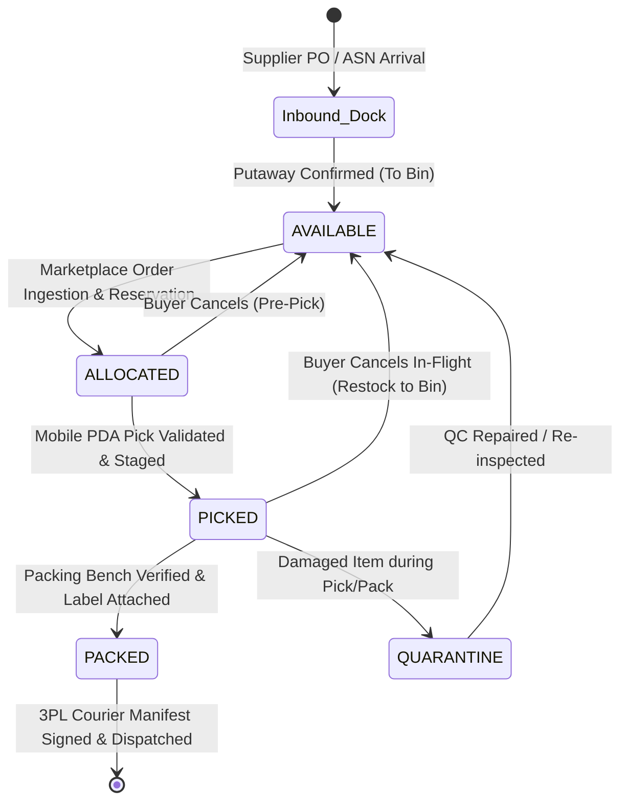
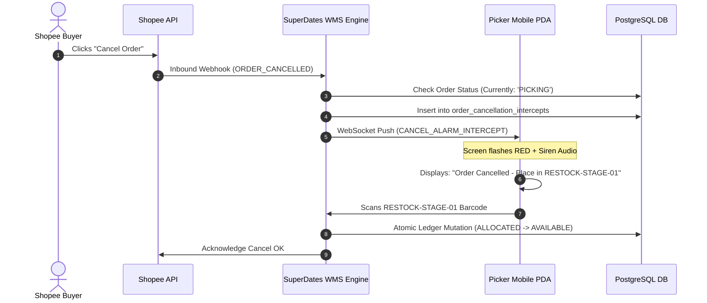

# SuperDates WMS - End-to-End Data Journey & Table State Lifecycle
## Interactive Data Table Mockup & Presentation Guide (v2.0)

---

## 1. Executive Presentation Overview

This document serves as the **Data Journey Blueprint** for the SuperDates Warehouse Management System (WMS). It visually illustrates how data flows through the normalized database tables defined in [`data_design.md`](file:///c:/External%20Project/SuperDates_Mockup/data_design.md) at every operational milestone.

### 1.1. The 5-State Inventory Balance Equation
Throughout every single step of the warehouse journey, the system enforces the strict **5-State Double-Entry Inventory Invariant**:

$$\boxed{\text{Stock on Hand (SOH)} = \text{Available} + \text{Allocated} + \text{Picked} + \text{Packed} + \text{Quarantine}}$$

---

## 2. Seed Master Data (The Presentation "Cast of Characters")

To make the presentation intuitive, we track a single real-world SKU: **Kurma Ajwa Premium 500g** (`KRM-AJWA-500G`) and a real multi-channel customer order from **Tokopedia**.

| Entity Type | Identifier / Code | Description / Metadata |
|---|---|---|
| **Warehouse** | `WH-JKT-01` | Main Distribution Center (Jakarta Barat) |
| **Master SKU** | `KRM-AJWA-500G` | Barcode: `8991001234561`, Weight: `0.550 kg`, Category: Dates |
| **Batch / Lot** | `LOT-2026-AJW-01` | Expiry Date: `2027-12-31`, QC Status: `APPROVED` |
| **Inbound Dock Bin** | `INBOUND-DOCK-01` | Virtual receiving location (`bin_type = 'INBOUND_DOCK'`) |
| **Pick Bin** | `ZN01-A01-R01-L02-B03` | Active picking shelf location (`bin_type = 'PICK'`) |
| **Staging Rack Bin** | `STAGE-A-04` | Picker-to-Packer transfer bin (`bin_type = 'STAGE'`) |
| **Sortation Chute** | `CHUTE-SPX-01` | Shopee Express sortation cage (`bin_type = 'CHUTE_SORT'`) |
| **Restock Bin** | `RESTOCK-STAGE-01` | Cancelled order hold bin (`bin_type = 'RESTOCK_STAGING'`) |
| **Marketplace Store** | `STORE-TKPD-01` | Tokopedia Official Store (Channel: `TOKOPEDIA`) |
| **Courier & Service** | `SPX` / `SPX-STD` | Shopee Xpress Standard Next Day |

---

## 3. Step-by-Step End-to-End Data Journey

---

### Step 1: Inbound Receiving, QC Inspection & Directed Putaway

#### Scenario
Supplier delivers **100 units** of `KRM-AJWA-500G` under Purchase Order `PO-2026-08-0001` and Advance Shipping Notice `ASN-2026-08-001`. The goods arrive at `INBOUND-DOCK-01`. The receiver performs QC, scans the batch expiry date, and the WMS creates a Directed Putaway task to place the goods into picking bin `ZN01-A01-R01-L02-B03`.

#### Data Table State 1A: Advance Shipping Notice & QC Log (`asns` & `asn_items`)
##### Table: `asns`
| id | asn_number | source_type | destination_warehouse_id | status | dock_bin_id | arrived_at |
|---|---|---|---|---|---|---|
| `asn-uuid-001` | `ASN-2026-08-001` | `SUPPLIER_PO` | `wh-jkt-01` | `QC_COMPLETED` | `bin-dock-01` | `2026-08-17 08:00:00+07` |

##### Table: `asn_items`
| id | asn_id | master_sku_id | expected_qty | received_good_qty | received_damaged_qty | lot_number | expiry_date | qc_status |
|---|---|---|---|---|---|---|---|---|
| `asnitm-uuid-001` | `asn-uuid-001` | `sku-ajwa-500g` | 100 | **100** | 0 | `LOT-2026-AJW-01` | `2027-12-31` | `PASSED` |

---

#### Data Table State 1B: Directed Putaway Task (`putaway_tasks`)
##### Table: `putaway_tasks`
| id | task_number | master_sku_id | quantity | source_bin_id | recommended_bin_id | actual_bin_id | status | completed_at |
|---|---|---|---|---|---|---|---|---|
| `put-uuid-001` | `PUT-2026-08-001` | `sku-ajwa-500g` | 100 | `bin-dock-01` | `bin-pick-b03` | `bin-pick-b03` | `COMPLETED` | `2026-08-17 08:25:00+07` |

---

#### Data Table State 1C: Inventory Balance & Double-Entry Ledger (Post-Putaway)
When the putaway operator scans `bin-pick-b03`, physical stock is credited into `qty_available`.

##### Table: `inventory_balances`
| id | warehouse_id | bin_id | master_sku_id | batch_id | qty_available | qty_allocated | qty_picked | qty_packed | qty_quarantine | SOH (Computed) | version |
|---|---|---|---|---|---|---|---|---|---|---|---|
| `bal-uuid-001` | `wh-jkt-01` | `bin-pick-b03` | `sku-ajwa-500g` | `batch-lot-01` | **100** | 0 | 0 | 0 | 0 | **100** | 1 |

##### Table: `inventory_ledger` (Transaction #1)
| id | transaction_uuid | master_sku_id | from_bin_id | to_bin_id | from_state | to_state | quantity | transaction_type | reference_doc_type | reference_doc_id |
|---|---|---|---|---|---|---|---|---|---|---|
| `ledg-001` | `tx-inbound-001` | `sku-ajwa-500g` | `bin-dock-01` | `bin-pick-b03` | `EXTERNAL_SUPPLIER` | `AVAILABLE` | **100** | `PUTAWAY` | `ASN` | `ASN-2026-08-001` |

---

### Step 2: Omnichannel Order Ingestion & Atomic Stock Reservation

#### Scenario
A customer purchases **2 units** of `KRM-AJWA-500G` on Tokopedia (External Order ID: `TKPD-99881122`). The webhook lands in the WMS. The system locks `inventory_balances` (`SELECT ... FOR UPDATE`), verifies stock availability, and reserves **2 units** (`Available` $\rightarrow$ `Allocated`).

#### Data Table State 2A: Omnichannel Order & Line Items (`orders` & `order_items`)
##### Table: `orders`
| id | order_code | store_id | external_order_id | wms_status | sla_tier | priority_level | courier_id | awb_number | allocated_at |
|---|---|---|---|---|---|---|---|---|---|
| `ord-uuid-001` | `ORD-2026-08-0001` | `store-tkpd-01` | `TKPD-99881122` | `ALLOCATED` | `REGULAR` | 3 | `courier-spx` | `SPXID0299881122` | `2026-08-17 09:00:15+07` |

##### Table: `order_items`
| id | order_id | master_sku_id | item_name | ordered_qty | allocated_qty | picked_qty | packed_qty | status |
|---|---|---|---|---|---|---|---|---|
| `orditm-001` | `ord-uuid-001` | `sku-ajwa-500g` | Kurma Ajwa Premium 500g | 2 | **2** | 0 | 0 | `ALLOCATED` |

##### Table: `order_item_allocations`
| id | order_item_id | warehouse_id | bin_id | batch_id | allocated_qty | status |
|---|---|---|---|---|---|---|
| `alloc-001` | `orditm-001` | `wh-jkt-01` | `bin-pick-b03` | `batch-lot-01` | **2** | `ALLOCATED` |

---

#### Data Table State 2B: Inventory Balance & Ledger Mutation (Post-Allocation)
Notice how `qty_available` drops from 100 to 98, while `qty_allocated` increases from 0 to 2. **SOH remains exactly 100**.

##### Table: `inventory_balances`
| id | warehouse_id | bin_id | master_sku_id | batch_id | qty_available | qty_allocated | qty_picked | qty_packed | qty_quarantine | SOH (Computed) | version |
|---|---|---|---|---|---|---|---|---|---|---|---|
| `bal-uuid-001` | `wh-jkt-01` | `bin-pick-b03` | `sku-ajwa-500g` | `batch-lot-01` | **98** $\downarrow$ | **2** $\uparrow$ | 0 | 0 | 0 | **100** | 2 |

##### Table: `inventory_ledger` (Transaction #2)
| id | transaction_uuid | master_sku_id | from_bin_id | to_bin_id | from_state | to_state | quantity | transaction_type | reference_doc_type | reference_doc_id |
|---|---|---|---|---|---|---|---|---|---|---|
| `ledg-002` | `tx-reserve-001` | `sku-ajwa-500g` | `bin-pick-b03` | `bin-pick-b03` | `AVAILABLE` | `ALLOCATED` | **2** | `ORDER_RESERVE` | `ORDER` | `ORD-2026-08-0001` |

---

### Step 3: Wave Batching, Mobile PDA Picking & Staging Handover

#### Scenario
The Outbound Supervisor generates Wave `WV-2026-08-0001` combining 25 orders for Shopee Express cut-off at 15:00.
Picker (`USR-PICK-01`) logs into mobile PDA with Tote `TOTE-001`:
1. Navigates to `ZN01-A01-R01-L02-B03` and **scans bin barcode** $\rightarrow$ PASSED.
2. Picks 2 units of `KRM-AJWA-500G` and **scans item barcode** `8991001234561` $\rightarrow$ PASSED.
3. Transports tote to packing area and **scans staging rack** `STAGE-A-04`.

#### Data Table State 3A: Wave & Pick Tasks (`waves`, `pick_tasks`, `pick_task_items`)
##### Table: `waves`
| id | wave_number | warehouse_id | wave_type | courier_id | total_orders_count | total_items_count | status |
|---|---|---|---|---|---|---|---|
| `wave-uuid-001` | `WV-2026-08-0001` | `wh-jkt-01` | `CARRIER_CUTOFF_BATCH` | `courier-spx` | 25 | 48 | `STAGED_FOR_PACKING` |

##### Table: `pick_tasks`
| id | task_number | wave_id | picker_user_id | assigned_tote_id | status | total_items_to_pick | total_items_picked |
|---|---|---|---|---|---|---|---|
| `ptask-001` | `PT-2026-08-001` | `wave-uuid-001` | `usr-pick-01` | `tote-001` | `COMPLETED` | 48 | 48 |

##### Table: `pick_task_items`
| id | pick_task_id | order_id | master_sku_id | source_bin_id | requested_qty | picked_qty | scan_bin_verified | scan_sku_verified | status |
|---|---|---|---|---|---|---|---|---|---|
| `ptitem-001` | `ptask-001` | `ord-uuid-001` | `sku-ajwa-500g` | `bin-pick-b03` | 2 | **2** | `TRUE` | `TRUE` | `PICKED` |

##### Table: `staging_handovers`
| id | wave_id | tote_id | staging_bin_id | picker_user_id | status | staged_at |
|---|---|---|---|---|---|---|
| `stghnd-001` | `wave-uuid-001` | `tote-001` | `bin-stage-a04` | `usr-pick-01` | `STAGED` | `2026-08-17 10:15:00+07` |

---

#### Data Table State 3B: Inventory Balance & Ledger Mutation (Post-Pick & Stage)
Stock shifts from `qty_allocated` $\rightarrow$ `qty_picked`. Physical location transfers from shelf bin `bin-pick-b03` $\rightarrow$ staging rack `bin-stage-a04`.

##### Table: `inventory_balances` (Shelf Bin: `bin-pick-b03`)
| id | warehouse_id | bin_id | master_sku_id | batch_id | qty_available | qty_allocated | qty_picked | qty_packed | qty_quarantine | SOH | version |
|---|---|---|---|---|---|---|---|---|---|---|---|
| `bal-uuid-001` | `wh-jkt-01` | `bin-pick-b03` | `sku-ajwa-500g` | `batch-lot-01` | 98 | **0** $\downarrow$ | 0 | 0 | 0 | **98** | 3 |

##### Table: `inventory_balances` (Staging Rack: `bin-stage-a04`)
| id | warehouse_id | bin_id | master_sku_id | batch_id | qty_available | qty_allocated | qty_picked | qty_packed | qty_quarantine | SOH | version |
|---|---|---|---|---|---|---|---|---|---|---|---|
| `bal-uuid-002` | `wh-jkt-01` | `bin-stage-a04`| `sku-ajwa-500g` | `batch-lot-01` | 0 | 0 | **2** $\uparrow$ | 0 | 0 | **2** | 1 |

##### Table: `inventory_ledger` (Transaction #3)
| id | transaction_uuid | master_sku_id | from_bin_id | to_bin_id | from_state | to_state | quantity | transaction_type | reference_doc_type | reference_doc_id |
|---|---|---|---|---|---|---|---|---|---|---|
| `ledg-003` | `tx-pick-001` | `sku-ajwa-500g` | `bin-pick-b03` | `bin-stage-a04` | `ALLOCATED` | `PICKED` | **2** | `PICK_TRANSFER` | `WAVE` | `WV-2026-08-0001` |

##### Table: `orders` (Status Transition)
| id | order_code | wms_status | updated_at |
|---|---|---|---|
| `ord-uuid-001` | `ORD-2026-08-0001` | `PICKED` | `2026-08-17 10:15:05+07` |

---

### Step 4: Packing Bench Verification, Weight Validation & Thermal Labeling

#### Scenario
Packer (`USR-PACK-01`) at Packing Bench `PACK-STATION-01`:
1. Scans `TOTE-001` / Order Invoice `ORD-2026-08-0001`.
2. Scans physical item barcode `8991001234561` twice $\rightarrow$ Validated against BOM.
3. Places items into Medium Polymailer and reads weight from USB scale: `1.150 kg`.
4. System automatically prints 100x150mm thermal shipping label (`SPXID0299881122`).
5. Packer confirms pack $\rightarrow$ System updates state (`Picked` $\rightarrow$ `Packed`).

#### Data Table State 4A: Packing Session & Shipping Label (`packing_sessions` & `shipping_labels`)
##### Table: `packing_sessions`
| id | session_number | station_id | packer_user_id | order_id | print_mode | actual_weight_kg | package_type | status | completed_at |
|---|---|---|---|---|---|---|---|---|---|
| `pcksess-001` | `PCK-2026-08-001` | `pack-stat-01` | `usr-pack-01` | `ord-uuid-001` | `PRINT_ON_PACK` | **1.150** | `POLYMAILER_M` | `PACKED_CONFIRMED` | `2026-08-17 10:45:00+07` |

##### Table: `shipping_labels`
| id | order_id | awb_number | courier_code | print_count | printed_by_user_id | first_printed_at |
|---|---|---|---|---|---|---|
| `lbl-001` | `ord-uuid-001` | `SPXID0299881122` | `SPX` | 1 | `usr-pack-01` | `2026-08-17 10:44:55+07` |

---

#### Data Table State 4B: Inventory Balance & Ledger Mutation (Post-Packing)
Stock shifts from `qty_picked` in Staging Rack $\rightarrow$ `qty_packed` in Sortation Chute `bin-chute-spx01`.

##### Table: `inventory_balances` (Staging Rack: `bin-stage-a04`)
| id | warehouse_id | bin_id | master_sku_id | batch_id | qty_available | qty_allocated | qty_picked | qty_packed | qty_quarantine | SOH | version |
|---|---|---|---|---|---|---|---|---|---|---|---|
| `bal-uuid-002` | `wh-jkt-01` | `bin-stage-a04`| `sku-ajwa-500g` | `batch-lot-01` | 0 | 0 | **0** $\downarrow$ | 0 | 0 | **0** | 2 |

##### Table: `inventory_balances` (Sortation Chute: `bin-chute-spx01`)
| id | warehouse_id | bin_id | master_sku_id | batch_id | qty_available | qty_allocated | qty_picked | qty_packed | qty_quarantine | SOH | version |
|---|---|---|---|---|---|---|---|---|---|---|---|
| `bal-uuid-003` | `wh-jkt-01` | `bin-chute-spx01`| `sku-ajwa-500g` | `batch-lot-01` | 0 | 0 | 0 | **2** $\uparrow$ | 0 | **2** | 1 |

##### Table: `inventory_ledger` (Transaction #4)
| id | transaction_uuid | master_sku_id | from_bin_id | to_bin_id | from_state | to_state | quantity | transaction_type | reference_doc_type | reference_doc_id |
|---|---|---|---|---|---|---|---|---|---|---|
| `ledg-004` | `tx-pack-001` | `sku-ajwa-500g` | `bin-stage-a04` | `bin-chute-spx01` | `PICKED` | `PACKED` | **2** | `PACK_DEDUCT` | `ORDER` | `ORD-2026-08-0001` |

##### Table: `orders` (Status Transition)
| id | order_code | wms_status | packed_at |
|---|---|---|---|
| `ord-uuid-001` | `ORD-2026-08-0001` | `PACKED` | `2026-08-17 10:45:00+07` |

---

### Step 5: 3PL Sortation, Digital BAST Manifest & Courier Dispatch

#### Scenario
1. Operator sorts package into Shopee Express cage: Scans AWB `SPXID0299881122` $\rightarrow$ Scans Chute Barcode `CHUTE-SPX-01` $\rightarrow$ System validates match.
2. Shopee Express driver arrives with truck plate `B 1234 SPX`.
3. Dispatcher (`USR-DISP-01`) closes Manifest `MAN-2026-08-0001` (25 packages, 28.5 kg). Driver signs digital canvas on tablet.
4. System executes atomic outbound dispatch transaction: Deducts physical stock from warehouse balance and pushes `SHIPPED` status callback to Tokopedia API.

#### Data Table State 5A: Sortation Scan & Digital Manifest (`sortation_scans` & `shipping_manifests`)
##### Table: `sortation_scans`
| id | order_id | awb_number | expected_chute_id | scanned_chute_id | is_match | scanned_by_user_id |
|---|---|---|---|---|---|---|
| `sort-001` | `ord-uuid-001` | `SPXID0299881122` | `bin-chute-spx01` | `bin-chute-spx01` | `TRUE` | `usr-disp-01` |

##### Table: `shipping_manifests` (Surat Jalan / BAST)
| id | manifest_number | courier_id | total_parcels_count | total_weight_kg | driver_name | driver_vehicle_plate | driver_signature_url | status | dispatched_at |
|---|---|---|---|---|---|---|---|---|---|
| `man-001` | `MAN-2026-08-0001` | `courier-spx` | 25 | **28.500** | Budi Santoso | `B 1234 SPX` | `https://s3/signatures/man-001.png` | `HANDED_OVER_3PL` | `2026-08-17 15:30:00+07` |

##### Table: `manifest_items`
| id | manifest_id | order_id | awb_number | parcel_weight_kg | scanned_at |
|---|---|---|---|---|---|
| `manitm-001` | `man-001` | `ord-uuid-001` | `SPXID0299881122` | 1.150 | `2026-08-17 15:20:00+07` |

---

#### Data Table State 5B: Final Outbound Balance Deduction & Ledger Mutation
Physical inventory leaves the warehouse building (`PACKED` $\rightarrow$ `EXTERNAL_CUSTOMER`).

##### Table: `inventory_balances` (Sortation Chute: `bin-chute-spx01`)
| id | warehouse_id | bin_id | master_sku_id | batch_id | qty_available | qty_allocated | qty_picked | qty_packed | qty_quarantine | SOH | version |
|---|---|---|---|---|---|---|---|---|---|---|---|
| `bal-uuid-003` | `wh-jkt-01` | `bin-chute-spx01`| `sku-ajwa-500g` | `batch-lot-01` | 0 | 0 | 0 | **0** $\downarrow$ | 0 | **0** | 2 |

##### Table: `inventory_ledger` (Transaction #5 - Final Outbound Departure)
| id | transaction_uuid | master_sku_id | from_bin_id | to_bin_id | from_state | to_state | quantity | transaction_type | reference_doc_type | reference_doc_id |
|---|---|---|---|---|---|---|---|---|---|---|
| `ledg-005` | `tx-dispatch-001` | `sku-ajwa-500g` | `bin-chute-spx01` | `NULL` | `PACKED` | `EXTERNAL_CUSTOMER` | **2** | `OUTBOUND_DISPATCH` | `MANIFEST` | `MAN-2026-08-0001` |

##### Table: `orders` (Final Dispatched State)
| id | order_code | wms_status | shipped_at |
|---|---|---|---|
| `ord-uuid-001` | `ORD-2026-08-0001` | `SHIPPED` | `2026-08-17 15:30:00+07` |

---

## 4. Exception Scenarios & Edge Case Data Journeys

---

### Exception 1: In-Flight Buyer Cancellation Intercept (During Picking)

#### Scenario
Buyer cancels order on Shopee while Picker is standing in Aisle 01 picking item `KRM-AJWA-500G`.
1. Marketplace sends `ORDER_CANCELLED` webhook.
2. System triggers `order_cancellation_intercepts`, pushes WebSocket alert to Picker's PDA with loud siren alarm.
3. System blocks item from wave and directs picker to place item into `RESTOCK-STAGE-01`.
4. Inventory balance moves: `Allocated` $\rightarrow$ `Available` in restock staging.

##### Table: `order_cancellation_intercepts`
| id | order_id | cancelled_at_wms_status | intercept_action_taken | assigned_restock_bin_id | resolution_status |
|---|---|---|---|---|---|
| `intrcpt-001` | `ord-uuid-002` | `PICKING` | `PICK_ABORTED_RETURN_BIN` | `bin-restock-01` | `GOODS_RESTOCKED` |

##### Table: `inventory_ledger` (Cancellation Restock Mutation)
| id | master_sku_id | from_bin_id | to_bin_id | from_state | to_state | quantity | transaction_type | reference_doc_type |
|---|---|---|---|---|---|---|---|---|
| `ledg-006` | `sku-ajwa-500g` | `bin-pick-b03` | `bin-restock-01` | `ALLOCATED` | `AVAILABLE` | 1 | `ORDER_CANCEL_RELEASE` | `ORDER` |

---

### Exception 2: Reverse Logistics (Customer RMA Return & QC Grading)

#### Scenario
Customer returns damaged package (`RET-2026-08-001`). Receiver scans return AWB at dock and inspects unboxing photos:
- 1 Unit is damaged $\rightarrow$ Graded `DAMAGED_QUARANTINE` $\rightarrow$ Moved to Quarantine Bin `ZN01-QUARANTINE-01`.
- 1 Unit is pristine $\rightarrow$ Graded `RESTOCKABLE_GOOD` $\rightarrow$ Moved to Pick Bin `ZN01-A01-R01-L02-B03`.

##### Table: `return_shipments`
| id | return_number | return_type | order_id | return_tracking_no | status | inspected_by_user_id |
|---|---|---|---|---|---|---|
| `ret-001` | `RET-2026-08-001` | `RMA_CUSTOMER_DISPUTE` | `ord-uuid-001` | `RET-SPX-99881` | `QC_COMPLETED` | `usr-inbound-01` |

##### Table: `return_shipment_items`
| id | return_shipment_id | master_sku_id | return_qty | qc_disposition | target_bin_id | notes |
|---|---|---|---|---|---|---|
| `retitem-001` | `ret-001` | `sku-ajwa-500g` | 1 | `RESTOCKABLE_GOOD` | `bin-pick-b03` | Seal intact, restocked to pick bin |
| `retitem-002` | `ret-001` | `sku-ajwa-500g` | 1 | `DAMAGED_QUARANTINE`| `bin-quarantine-01` | Crushed plastic box, claim to courier |

##### Table: `inventory_ledger` (RMA Returns Mutations)
| id | master_sku_id | from_bin_id | to_bin_id | from_state | to_state | quantity | transaction_type |
|---|---|---|---|---|---|---|---|
| `ledg-007` | `sku-ajwa-500g` | `NULL` | `bin-pick-b03` | `EXTERNAL_CUSTOMER` | `AVAILABLE` | 1 | `RMA_RESTOCK` |
| `ledg-008` | `sku-ajwa-500g` | `NULL` | `bin-quarantine-01`| `EXTERNAL_CUSTOMER` | `QUARANTINE` | 1 | `QUARANTINE_TRANSFER` |

---

## 5. Master Summary Table State Matrix (Presentation Cheat Sheet)

This cheat sheet summarizes the complete numerical progression of **Kurma Ajwa 500g** across all 5 milestones:

| Milestone | Event / Trigger | `qty_available` | `qty_allocated` | `qty_picked` | `qty_packed` | `qty_quarantine` | **SOH Total** | Ledger Tx Type |
|---|---|---|---|---|---|---|---|---|
| **0. Initial** | Empty warehouse | 0 | 0 | 0 | 0 | 0 | **0** | - |
| **1. Putaway** | ASN Inbound 100 units | **100** | 0 | 0 | 0 | 0 | **100** | `PUTAWAY` |
| **2. Order Ingestion** | Tokopedia buys 2 units | **98** | **2** | 0 | 0 | 0 | **100** | `ORDER_RESERVE` |
| **3. Wave Pick** | Mobile PDA picks & stages | 98 | **0** | **2** | 0 | 0 | **100** | `PICK_TRANSFER` |
| **4. Packing Confirm**| Verified, polymailer sealed | 98 | 0 | **0** | **2** | 0 | **100** | `PACK_DEDUCT` |
| **5. 3PL Dispatch** | Manifest BAST signed | 98 | 0 | 0 | **0** | 0 | **98** | `OUTBOUND_DISPATCH` |

$$\text{Final Physical Warehouse Inventory} = 98 \text{ units remaining in } \text{ZN01-A01-R01-L02-B03}$$
